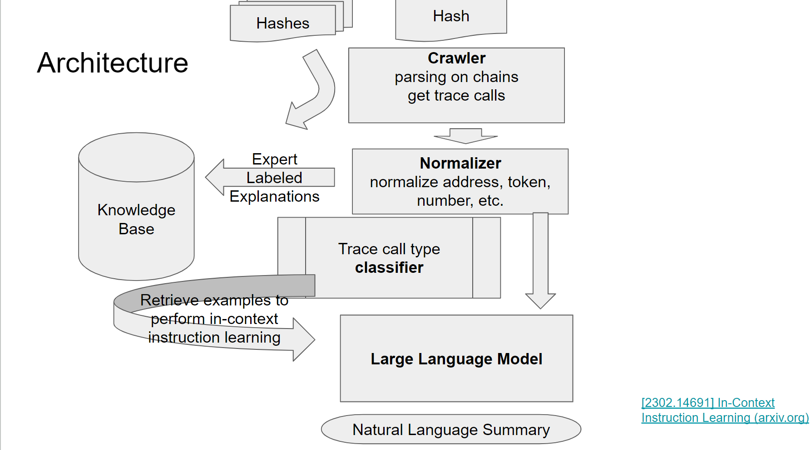

#  eth-gleeman

**1 项目名称**: eth-gleeman

**2 所选赛道**: Public Goods

**3 项目图片**:


**4 简介**: 
eth-gleeman是一款结合gpt3.5/4和promt工程解释evm链上交易内容的工具。


给定一个特定的transaction，eth-gleeman会通过debug_traceTransaction获取交易详细的call trace，并将call trace decode成可读内容。

将交易类型分类（例如swap，stake，lending……）获取各类交易的call trace，并添加自然语言描述，然后讲这些内容构造成不同类型的prompt，告诉gpt3.5/4 如何解释call trace，将每一条call trace解释成自然语言内容， 例如
```
usdc.transferFrom(alice, bob, 100) => 'alice transfer 100 usdc token to bob'
```
将call trace 的解释连起来，用gpt3.5/4 总结文本进而解释完整的交易内容


**5 队长和队员**: 

[@1vkc](https://github.com/1vkc) 
[@David Lee](https://github.com/daviddwlee84)    
[@0xStorageRoot](https://github.com/0xStorageRoot)
[@freyazh](https://github.com/freyazh)

**6 本项目在这次黑客松的目标:**

目标：本次黑客松的目标是先在构造的工作流程上用ai解释几个常见类型交易的内容，后续可以添加流程使工具更通用化。

**7 黑客松前两日的进度**
- Day 0:
  - [x] 制定项目目标，决定实现架构。
  - [x] 细化任务：
    1. 决定chatgpt需要的prompt结构类型。
    2. 确定transaction-trace-explanation-prompt的工作流程
- Day 1:
  - [x] 数据抓取和清洗。
  - [x] prompt调优
- Day 2:
  - [x] 调试demo（覆盖了uniswapV2&V3 的交易和添加流动性的场景）
  - [x] 准备文档
  - [x] 录制视频

**8 视频链接:**
https://www.bilibili.com/video/BV1V94y1t7jf/

**9 项目 github repo 链接:**
所有代码都在https://github.com/1vkc/eth-gleeman

**10 是否基于之前的项目:**
该项目是本次hackathon期间，从0到1开发的项目，完全原创。
