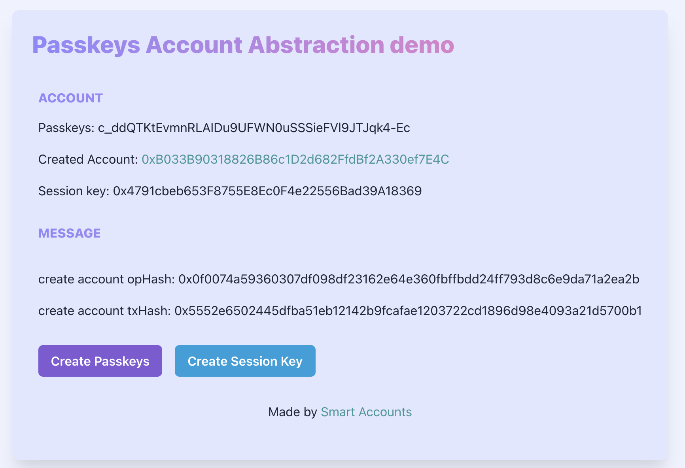

# ETH Hangzhou Hackathon 项目提交说明

ETH Hangzhou Hackathon 的项目需要提交到本页，PR（Pull-Request）截止时间为 2023年10月16日 下午14:00（北京时间，UTC+8）。你需要在你的项目下更新以下内容:

❗❗❗项目提交 PR 示例详见：https://github.com/eth-hangzhou/ETHHangzhou/pull/6

# 1. Pinnect

**1 项目名称**: Pinnect

**2 所选赛道**: Layer 2 Application

**3 项目图片**:


**4 简介**: 

Game-map collaboration, all for gammers.

Pinnect is a visionary platform designed to revolutionize collaborative storytelling within the Ethereum ecosystem. With a seamless blend of interactive map exploration, tag management, and relationship visualization, Pinnect empowers users to co-create immersive narratives and gaming experiences like never before.
Key features:
1. Interactive Map Collaboration: Pinnect offers an engaging map interface where users can explore, contribute, and interact with various storytelling locations. Each click on the map initiates a unique narrative journey, connecting users through a shared gaming universe.
2. Efficient Tag Editing: Managing tags has never been easier. Pinnect's tag editing interface allows users to refine titles, descriptions, and relationships effortlessly. Users can create hyperlinks between tags and ensure organized and interconnected storytelling.
3. Relationship Flow: Pinnect's Relationship Flow feature simplifies tag relationship visualization. Users can connect tags, choose direction (preceding or following), and define relationship types, enabling branching storylines and fostering creative collaboration.
4. On-Chain Contribution: Pinnect promotes fairness and transparency through on-chain contributions. Content is securely anchored on the blockchain, ensuring equitable rewards and incentivizing active participation.
5. Cross-Platform Wallet Integration: Our platform offers cross-platform wallet support, allowing users to seamlessly access their Ethereum wallets across various devices and platforms, making transactions and asset management convenient and consistent.


**5 队长和队员**: 

**Race Li**, co-initiator of magipop, serial entrepreneur, 2nd venture backed founders, previously founded an AI Music startup, made a social app with 1 million+ downloads, Apple WWDC (Worldwide Developers Conference) Scholarship Winner, Hurun U30 Winner, electronic musician.

**Setsukousa**, co-initiator of magipop, senior Web3 researcher, research published in Chaos, Solitons & Fractals, cryptocurrency investors, master in financial physics at ZJU, metaverse consultant at fine arts institute.


**6 本项目在这次黑客松的目标:**

- The project is an original creation that started from scratch during this hackathon. We aim to create a practical solution in the field of collaborative creativity within gaming communities.
- We plan to integrate and utilize the Ethereum ecosystem, exploring high-performance creative collaboration solutions through Layer2 integrations.
- We look forward to moving forward together with talented buidlers globally.

**7 黑客松前两日的进度**

- On the Oct 13th and 14th, we discussed and validated concepts, and performed user validation.
- From the Oct 14th to the 15th, we divided tasks and carried out front-end and back-end development, contract deployment, and debugging.

**8 视频链接:**

Pitch & demo video: https://youtu.be/Tr6Xrd_Swys
Deck: https://docsend.com/view/x64yntk9zrs73uqj

**9 项目 github repo 链接:**

https://github.com/DocRace/pinnect-eth-hangzhou

**10 是否基于之前的项目:**

This project, developed from scratch during this hackathon, is a completely original creation.


# 2. EthDA

**1 项目名称**: EthDA

**2 所选赛道**: Public Goods

**3 项目图片**:


**4 简介**: 

Layer 2 Rollup 是目前最主流的以太坊扩容方案，一些知名的 Rollup 项目如 Arbitrum、 Optimism、Base 等也陆续上线主网并迎来了生态的爆发。社区预计未来会有更多的 Rollup 涌现。从技术架构上讲，所有的 Rollup 都需要一个 Data Availability 层来存储 L2 上的交易执行结果、以及 Transaction Data 来做 Fraud Proof。而以太坊就是所有 Rollup 链的默认 DA 层，也是最原生、从共识机制上最安全的 DA 层。

随着 Rollup 链的数量的增加，以及 Rollup 链上应用生态的发展，以太坊做为 DA 的存储容量和效率都亟待提高。社区对此的长期解决方案是 Danksharding。由于 Danksharding 需要较长时间开发和部署，社区又提出了 Proto-Danksharding (或者 EIP-4844) 做为短期过渡方案。EIP-4844 做为坎昆升级的重要部分，目前社区正在积极开发和测试中。

EthDA 的目的是在 EIP-4844 的基础上，进一步将以太坊 DA 的容量、效率和经济性 (Gas费用) 拓展到互联网应用的水平。我们的方式是用 OP Stack 启一条 Layer 2 的 Plasma Chain，在上面支持 EIP-4844 的 Blob TX，接收到的 Blob 以 Merkle Blob Tree 的形式，保存在一组去中心化的 Sequencers 节点中。Sequencers 采用 Danksharding 中的 Data Availability Sampling 机制来确保 Blobs 的分片 Sharding 和持久存储。

Rollup 采用 EthDA 做为 DA 层时，直接调用 EthDA 上的智能合约向 EthDA 发送 Blob TX。EthDA 上的 Sequencer 将 Blob 存储之后，向 L1 上的智能合约提交 Storage Proof。Rollup 在 L1 上的 Rollup Contracts 就可以直接检查 Storage Proof 来验证 Blob 是否已经被存储。在检测到可疑的交易需要做 Fraud Proof 的时候，验证节点就可以从 EthDA 下载完整的 Blob，读取其中的数据进行验证。


**5 队长和队员**: 

队长：[gavfu](https://github.com/gavfu)，[EIP-5625](https://eips.ethereum.org/EIPS/eip-5625) 的贡献者

队友：[TonyCode2012](https://github.com/TonyCode2012)，Shawn，Steve

**6 本项目在这次黑客松的目标:**

由于 EIP-4844 正在开发之中，尚未在 Goerli 等测试网部署，加之时间有限，EthDA 在本次黑客松中的目标主要是做 DA 概念的验证和展示。具体来讲，我们要做的是：

1. 用 OP Goerli 来代表 EthDA，在上面部署智能合约，接收其他 Rollup 以 calldata 形式提交的 DA Data
2. 部署一个 Monitor Service，代表 EthDA Sequencer 节点的一个功能模块，用来监听智能合约收到的 DA Data
3. 将 Crust Network 做为 L1 DA 层，Monitor Service 将监听到的 DA Data 持久存储到 Crust Network

**7 黑客松前两日的进度**

- Day 0
  - 完成组队，讨论确定 EthDA 在本次黑客松中明确可交付的目标
  - Github 组织创建：https://github.com/EthDA
  - 细化任务
    - 开发 EthDA 智能合约，接收 calldata，并 emit Event 方便监听
    - 部署智能合约到 OP 测试网
    - 开发 Monitor Service，监听智能合约的 Event，读取 DA Data
    - 研究 Crust Network 的存储、访问接口，准备需要的 Gas
    - 将 DA Data 存储到 Crust Network
- Day 1
    - 系统联调，跑通 EthDA 合约调用、监听、存储到 Crust Network 并验证访问等完整流程
    - 完成项目图片、demo视频等，提交 team info PR

**8 视频链接:**

https://youtu.be/pJqrgKeUpLo

**9 项目 github repo 链接:**

https://github.com/EthDA/HangzhouHackathon

**10 是否基于之前的项目:**

该项目是本次hackathon期间，从0到1开发的项目，完全原创。

# 3. Magiry.ai

### Track
   
Layer 2 Application

### Introduction of Magiry.ai

On-chain contribution recorder for idea collaboration.
Making creative collaboration in the 'Open Studio' possible.


Magiry.ai is a tool for team graphic and text creative collaboration on the Ethereum. 


GPT-4-based AI model that automatically analyzes user-posted graphic and text content on the same topic, includes: 
- automatic association and referencing of existing content
- copyright confirmation
- automatic estimation of 'creative contribution' to the content.


Once approved by a token-staked manager (staker), it becomes an automated record of creator tokens.


Super easy way for creator onboarding:


   
### Team
    
- **bL1nk^**: Full stack developer, 
AI algorithm, 2018 Apple WWDC Scholarship winner
- **Serein Ai**: Expert in creator economy, former Alibaba, operated 1 million+ creators, 10 million+ DAU Content App, responsible for creator live streaming e-commerce with an annual $3 billion+ GMV
    
### Goals for This Hackathon

1. Buidling Magiry.ai for easier and transparent creative collaborations on Ethereum.
2. looking forward to moving forward together with talented buidlers globally.
3. Exploring high-performance creative collaboration solutions through Ethereum Layer2 integrations.

### Progress in the First Two Days of the Hackathon

1. Design product core functions, user flow and art style
2. Initialize GPT4 API to Ethereum while minimizing the on-chain interaction.
3. Tested creative recording and tokenomics frameworks.

### Demo Link

[Pitch Video of Magiry.ai](https://youtu.be/ifuIPDwWeJ4)

### Github repo
    
[repo of Magiry.ai](https://github.com/Kincc-9999/magipop_Magiry.ai)

### Originality Statement
    
This project, developed from scratch during this hackathon, is a completely original creation.

# 4. FairSharing

项目名称：FairSharing - 一个解决公平分配的tool
所选赛道：Public Goods
项目图片：
!https://cdn.nlark.com/yuque/0/2023/png/5377219/1697419291529-67dbab2c-1536-43bd-9dee-c89cce50fd4c.png

简介：
去中心化、透明、远程的协作方式越来越流行，这种协作方式是全新的生产关系，也就需要新的Native的tool，FairSharing就是这类tool的探索，通过记录项目成员的贡献到链上，然后按照贡献公平分配，从而激励更多人创造。
典型use case：比如DAO或社区内的小团队做一个项目；比如Grant提供方希望track被资助项目的协作过程和交付结果     
技术上我们利用了ETH的L2（OP）和EAS（Ethereum Attestation Service）。

队长和队员：Mike (@xiaohou77)，Kahn (@crazyyuan)

本项目在这次黑客松的目标：Day 1完成合约，Day 2/3完成前后端

黑客松前两日的进度：完成了基本流程的demo


# 5. WeiWallet

💰**WeiWallet**（多签钱包）

## 所选赛道（Public Goods，Layer2 Application，Zero Knowledge 主赛道三选一）

Public Goods

## 项目图片（1张有代表性的图片，不要过长）


## 简介

WeiWallet借鉴了SAFE钱包并进行创新，市面上的多签钱包都是以**门限值**的形式进行创建的，这种类型的多签特点就是每位成员的“决策份量”是一样的，那么就会产生一种问题，既成员的资金占比不同，所要获得的“决策份量”权益也不同，最合理的办法就是**按照权重百分比的形式进行“决策权”的分配**。所以这也是WeiWallet解决的问题：在创建钱包的阶段用户进行权重的分配，规定每位成员所占比例，并且设置权重类型的门槛值。打个比方：user1（权重40%），user2（权重30%），user3（权重30%）权重的门槛值为：50%。那么必须至少两人进行签名，事务才可以进行。

## 产品部分功能展示

在设置功能中可以对钱包成员进行：删除、替换、新增、更改用户权重、更改权重门槛值的功能

### 

删除用户，需要对权重值进行重新分配

### 

### 

### 


### 添加成员

### 

### 


### 

## 队长和队员

- fatdove（@fatdove77）-前端开发
-  0xE (@YiJingGuo) -合约开发
- ed (@China-Chris) -后端开发

## 本项目在这次黑客松的目标

完成权重值多签钱包的创建工作，完成多签钱包最基本的事务类型（转账、成员操作）。

## 黑客松前两日的进度

- day1：
  - 头脑风暴确定demo方案，团队成员集体讨论并确定Demo的方向和目标
  - 制作demo原型创，建一个简单的Demo原型
  - 绘制ui，设计应用的用户界面，包括页面布局、颜色、字体等。
  - 前端根据ui进行页面的绘制
  - 合约开发编写工厂合约与逻辑合约，完成钱包的clone创建、成员的初始化，基于EIP-712完成添加成员，踢出成员，替换成员，并进行测试。
  
- day2：

  - 合约部署，部署智能合约到区块链网络中

  - 准备域名
  
  - 部署后端程序，将程序部署到测试服务器上
  
  - 合约开发完成修改成员权重值，修改权重门限值，用户的钱包创建时的salt值记录、时间记录等。
  
  - 前端开发根据合约和后端接口，前端进行业务逻辑的接入，完成：权重钱包创建，转账功能，添加成员，踢出成员，替换成员，修改成员权重值功能。
  
  - 联合调试，前后端联合调试代码
  
  - 录制 demo 视频
  
    


## Demo 视频链接（可以是录屏或其他形式），可以选择的视频平台：[Youtube](https://youtube.com)，[Bilibili](https://bilibili.com)，[Loom](https://www.loom.com/)，视频长度不能超过3分钟，否则扣分。

[Weiwallet introduction video of ETH HangZhou Hackathon_哔哩哔哩_bilibili](https://www.bilibili.com/video/BV16H4y1R7ZN/?spm_id_from=333.999.0.0&vd_source=db89d007f7de87088a6b79918a5525fc)

## 项目 github repo 链接

前端：[fatdove77/MultipleSignatureWalletHZHackathon (github.com)](https://github.com/fatdove77/MultipleSignatureWalletHZHackathon)

后端：https://github.com/China-Chris/MultipleWallets

合约：[YiJingGuo/ETH-HangZhou-Hackathon-WeiWallet: ETH Hangzhou Hackathon Project｜基于权重值的多签合约钱包（合约部分） (github.com)](https://github.com/YiJingGuo/ETH-HangZhou-Hackathon-WeiWallet)

## 声明

该项目是本次hackathon期间，从0到1开发的项目，完全原创

## 项目 Demo 链接（选填）

https://neweddy.top/


# 6. State Identification

**1 项目名称**: State Identification

<a href="https://ibb.co/Lx5qFpP"></a>

**4 简介**: 

状态存证是基于状态通道技术，针对Massive Adoption开发的Web3公共物品，便于项目方进行链上合约的部署与交互，并通过链上合约保障用户资产安全，避免项目方作恶，降低项目方服务器被攻击时的损失

**5 队长和队员**: 

队长: [@北海](https://github.com/smileonesmile) 队友：[@donald](https://github.com/shamirsecret) 
**6 本项目在这次黑客松的目标**

目标：
1. 创建状态存证合约 state identification，能够按照参数要求返回所有相关的信息。
    ```solidity
    function openChannel(uint256 amount)
    function _updateBalance(address participant, uint256 newBalance)
    function closeChannel(uint256 newBalance, uint256 close_nonce, bytes calldata adminSignature) external
    ```
2. 新建一个页面，用来演示整个状态存证和数据库交互

**7 黑客松前两日的进度**
- Day 0:编写合约

- Day 1:编写演示前后端

**8 视频链接**
[点击这里观看视频](https://www.youtube.com/watch?v=GcKP-ao5HUQ)

**9 项目 github repo 链接**
所有代码都在
[https://github.com/ShamirSecret]
**10 是否基于之前的项目**
该项目是本次hackathon期间，从0到1开发的项目，完全原创。
**24.11 项目 Demo 链接（选填）**
http://124.221.74.51:5000

# 7. MOD 6551

**1 项目名称**: MOD 6551

**2 所选赛道**: Public Goods

**3 项目图片**:


**4 简介**: 

ERC6551 是一个让人兴奋的协议，它让任何 NFT 可以作为一个钱包。从钱包的角度讲，我们终于可以有一个固定的钱包地址，并且私钥则可以经常更新，以保证资产安全。

但是，6551 和 AA 一样，需要每个用户部署一个合约，带来两个问题 1. 用户需要支付昂贵的 gas 2. 链上状态爆炸。
我们正在设计建设的以太坊兼容 L1 BitPoW 公链的重要目标，必须抑制状态爆炸！（私货：gas我们可以超级便宜，不是问题）因为节点的膨胀会导致区块链的中心化。
所以我们选择魔改 ERC6551 来实现我们的目标，在新的 L1 和大量 L2 上，我们完全有条件部署升级版本的 ERC20，避免每个用户部署一个新的智能合约。

**5 队长和队员**: 

队长: [KJ](https://github.com/kernel1983)

**6 本项目在这次黑客松的目标:**

目标：
1. 修改 ERC20 数据结构，能够使 balances 和 allowed 能够支持 tokenid：
    ```solidity
    mapping (address => mapping (uint256 => uint256)) public balances;
    mapping (address => mapping (uint256 => mapping (address => mapping (uint256 => uint256)))) public allowed;
    ```
    同时重载方法，支持 tokenid：
    ```solidity
    function balanceOf(address _owner) external view returns (uint256 balance);
    function balanceOf(address _owner, uint256 _from_tokenid) external view returns (uint256 balance);
    function transfer(address _to, uint256 _value) external returns (bool success);
    function transfer(address _to, uint256 _value, uint256 _from_tokenid, uint256 _to_tokenid) external returns (bool success);
    function transferFrom(address _from, address _to, uint256 _value) external returns (bool success);
    function transferFrom(address _from, address _to, uint256 _value, uint256 _from_tokenid, uint256 _to_tokenid) external returns (bool success);
    ```
2. 本地快速合约测试脚本，用于测试驱动开发。
    https://github.com/kernel1983/mod6551/blob/main/scripts/mod6551.py
    ```bash
    brownie run mod6551 --network hardhat
    ```
   
**7 黑客松前两日的进度**
- Day 0:
  - [x] 确定项目和目标 GitHub repo 的新建：https://github.com/kernel1983/
  - [x] 细化任务：
    1. 修改 ERC20 数据结构。
    2. 修改 ERC20 transfer 方法，以及快速测试脚本。
    3. 修改 ERC721，增加erc20_transfer方法。
    4. 修改 ERC20 approve 方法和 transferFrom 方法。
    5. Option，创建一个UI。
  - [x] 查看 foundry 文档，以及源码，确定修改路径。
- Day 1:
  - [x] 完成任务 1-3。
  修改数据结构比较顺利，在修改 transfer 方法的时候，使用 brownie 调试代码比较烧脑，为了增加效率引入了快速测试脚本。
- Day 2:
  - [x] 完成任务 4。
  - [ ] 开始任务 5 快速学习 CSS 框架。
  因为 solidity 代码我们之后也要用 python 再做一遍，但是构建的 UI 前端未来可以复用，所哟我们佛系的开发了 UI。
- Day 3:
  - [x] 完成 team info。
  - [ ] 持续完善任务 5。
**8 视频链接:**
https://youtu.be/NMWOreI3nEw
**9 项目 github repo 链接:**
https://github.com/kernel1983/mod6551
**10 是否基于之前的项目:**
该项目是本次hackathon期间，从0到1开发的项目，完全原创。
本项目服务以太坊生态，同时也用于我们的新公链 L1 BitPoW。
**24.11 项目 Demo 链接（选填）:**

# 8. GasTokens
**1 项目名称**: GasToken

**2 所选赛道**: Layer2 Application

**3 项目图片**:


**4 简介**: 

在社交金融（SocialFi）或游戏金融（GameFi）项目中，能够从交易中扣除税费并将税费分配给所有代币持有者是一个非常吸引人的特点。想象一下，当一个玩家在游戏中进行交易时，其他所有玩家都可以从中获得收益，这不仅可以增加玩家的收入，还可以大大提高玩家的参与积极性和活跃度。这种机制鼓励了更多的玩家参与和互动，从而为整个生态系统创造了更大的价值。然而如何有效、公平且低成本地分配交易税费成为了一个核心问题, GasToken应运而生，旨在为此问题提供一个创新的解决方案。  
Transactionless: GasToken的最大亮点之一是它的"transactionless"特性。与传统方法不同，用户无需主动调用任何函数或进行任何交易。一旦有交易发生，税费将自动、即时地分配给所有代币持有者。这大大简化了用户的操作，同时也降低了gas的消耗。  
Frictionless收益：用户获得的收益是无摩擦的，意味着他们可以随时、无任何限制地访问和使用这些收益，无需担心额外的费用或延迟。

**5 队长和队员**: 

队长: [Joe](https://github.com/1anyway)&nbsp;&nbsp;&nbsp;<a href="mailto:zhouzhe194@gmail.com">zhouzhe194@gmail.com</a>

**6 本项目在这次黑客松的目标:**

目标：
1. 使用solidity智能合约实现reflection核心算法  
2. 以ERC20 token(GasToken)为例实现该算法的应用

**7 黑客松前两日的进度**  

Day0:  

查找相关资料，阅读算法paper，调研市面上成功的reflection token的应用


Day1:  
根据算法开始进行工程上的初步实现，使用solidity编写核心算法，使用Foundry搭建测试框架。


**8 视频链接:**  

https://www.youtube.com/watch?v=rfGEdIT6pFw

**9 项目 github repo 链接:**   

所有代码都在  

https://github.com/1anyway/GasTokens  

**10 是否基于之前的项目:**  

该项目是本次hackathon期间，从0到1开发的项目，完全原创。

**11 项目 Demo 链接（选填）:**  

https://www.youtube.com/watch?v=rfGEdIT6pFw

# 9. X-Wallet
1. 项目名称

  **X-Wallet**

2. 所选赛道

  *L2 Application*

3. 项目图片（1 张有代表性的图片，不要过长）

  

  

  

4. 简介

  Twitter Onboarding AA Wallet

5. 队长和队员

  队长：Luki

  队员：Skyh，Jun，Neal

6. 本项目在这次黑客松的目标

twitter 插件，接入 AA，预计算 AA 钱包地址，AA 钱包转账

7. 黑客松前两日的进度

D1:研究 Zerodev 和 Twitter 插件

D2:解决预计算地址难题和前端设计开发

D3:水会通宵开发

8. Demo 视频链接

https://www.youtube.com/watch?v=6F5nezkBNHs

9. 项目 github repo 链接

https://github.com/0xLukin/x-wallet-ethhangzhou

10. 声明未基于之前的项目，

该项目是本次 hackathon 期间，从 0 到 1 开发的项目，完全原创。

11. 项目 Demo 链接（选填）

https://github.com/0xLukin/x-wallet-ethhangzhou/blob/main/xwallet.zip

# 10. AI-based Smart Contract Explorer

**1 项目名称：**

AI-based Smart Contract Explorer

**2 所选赛道：** 

公共物品 （Public Goods）

**3 项目图片：**


**4 简介：**

AI-based Smart Contract Explorer 是一个 基于向量数据库和 LLM 进行 ETH 智能合约代码检索的浏览器，搜索结果包含智能合约原文、出处、代码解析等多维度内容。向量数据库技术是人工智能应用中的一项重要技术，通过 ANN 最似近邻算法，我们可以通过自然语言进行联想式搜索，而非传统的关键字搜索。立项起因是传统搜索代码的浏览器，例如 Etherscan，仅能搜索出原始代码。我们希望通过 AI 赋能，建立关于智能合约代码的全维度搜索，让合约开发者的效率指数倍增。

**5 队长和队员：**

队长：Keighteen777

队友：Taki WANG

**6 本项目在这次黑客松的目标:**

搭建项目雏形，打通数据流，进行关键代码的提交和小规模数据量的功能完成展示。例如: 输入find all the smart contracts about DID ,能够返回对应语义的代码数据。

**7 黑客松前两日的进度**

| Day0: |      |                                                              |
| ----- | ---- | ------------------------------------------------------------ |
|       |      | 完成组队 & 新建repo：<br />https://github.com/NonceGeek/ai-based-smart-contract-explorer<br />https://github.com/NonceGeek/movespace_db_uploader_cli |
|       |      | 任务梳理：                                                   |
|       |      | 1. **数据同步：**通过 Syncer同步全链上智能合约代码。         |
|       |      | 2. **代码解析：**通过Semantics Analyser将代码按语义解析归类。 |
|       |      | 3. **数据存储：**将解析过的合约代码数据存入向量数据库集群。  |
|       |      | 4. **CLI 工具：**提供 CLI 工具实现 1、2、3功能。             |
|       |      | 5. **提供服务API:** 梳理功能，建立对应的内外部 API。         |
|       |      | 6. **前端页面：**绘制前端页面，并联调接口。                  |
|       |      | 7. **治理合约：**完成关键治理合约。                          |
|       |      | 8. **线上部署：**将合约部署至 Mumbai 网络，将 App 部署至 Vercel。 |
| Day1: |      | 完成3、4，完成基础 6。                                       |
|       |      | 完成7，升级 6。                                              |
|       |      | 完成 8。                                                     |
|       |      | 完成 team info 以及Demo视频录制等。                          |

**8 视频链接:**

https://youtu.be/zeY9lp2Hcwo

**9 项目 github repo 链接:**

https://github.com/NonceGeek/ai-based-smart-contract-explorer

https://github.com/NonceGeek/movespace_db_uploader_cli

**10 是否基于之前的项目:**

该项目是本次 hackathon 期间，从0到1开发的项目，完全原创。

**11 项目demo:** 

> https://smart-contract-explorer.movespace.xyz/


# 11. AI Social Pet

**1 项目名称：**

AI Social Pet

**2 所选赛道：** 

Layer2 Application

**3 项目图片：**

https://aipet.hm-swap.com//static/img/SociaPet.png

**4 简介：**

AI宠物社交是一个结合Web3与人工智能技术的社交圈子，旨在连接和服务宠物主人和爱宠们。这个社交圈子提供了一个平台，用户可以分享他们的宠物生活、经验和照片，并与其他宠物主人进行互动和交流。通过AI技术，宠物社交圈子可以提供一系列功能和服务，如个性化宠物NFT、人宠互动等。此外宠物社交圈子还成立了一个救助站，旨在支持那些需要援助和保护的宠物；该救助站通过DAO组织的方式进行投票决定。总之，AI宠物社交圈子提供了一个互动、有趣和有益的平台，促进宠物社区的连接和交流。

**5 队长和队员：**

队长：PanRios
队员：阿兵

**6 本项目在这次黑客松的目标:**

1、基于EIP6551协议构造宠物NFT
2、对接百度API接口，通过上传宠物图片定制个性化宠物NFT
3、实现社交圈子基本功能

**7 黑客松前两日的进度**

D1
  - 完成组队，讨论确定 AiSocialPet 在本次黑客松中明确可交付的目标
  - Github 组织创建：https://github.com/Ripe007/AI-Social-Pet
  - 细化任务
    - 开发遵循EIP6551协议宠物NFT智能合约
    - 部署智能合约到 OP 测试网
    - 对接百度AI接口，定制个性化NFT
D2
    - 实现社交圈子基本功能
    - 构思宠物救助站、DAO组织想法思路

**8 视频链接:**
PDF: https://gamma.app/public/AI-Social-Pet-2fogjtm0f0123je
视频：https://www.bilibili.com/video/BV1s34y1g7FA/

Todo

**9 项目 github repo 链接:**

https://github.com/Ripe007/AI-Social-Pet


**10 是否基于之前的项目:**

该项目是本次 hackathon 期间，从0到1开发的项目，完全原创。

**11 项目demo:** 

https://aipet.hm-swap.com/


# 12. SpotLive

**1 项目名称**: SpotLive

**2 所选赛道**: Layer2 Application

**3 项目图片**:


**4 简介**: 

SpotLive通过用户在地点的打卡构成活动地标（SBT）。参与者上传活动记录，数据GPT化之后提供问答服务。不同的服务定价模式一致，用户通过铸造或赎回服务凭证（Pass）影响价格供需曲线波动。上传者根据Pass价格和使用量获得收益。
活动地标和问答服务既给用户提供学习（自我实现）价值，也给用户提供情绪价值。整个平台给活动和事件提供更多的时间维度和热度信息，不同活动之间的关系也得以体现，从长期来看，能构建出一个多彩的增强现实世界。

**5 队长和队员**: 

队长: Harry Ma

队员: Stella Zhang

队员: Leon Li


**6 本项目在这次黑客松的目标:**

目标：

**7 黑客松前两日的进度**

- Day 0:
  - 项目方案讨论, 产品原型设计


- Day 1:
    - 需求分析与技术方案设计
        + 前端方案设计
            * React作为主语言开发
            * 使用google js sdk 完成地位空间信息的获取与展示
            * metamask钱包作为操作对象
        + 后端方案设计
            * 使用golang作为后端开发语言，提供rest等接口
            * 调用4everland的ipfs接口完成文件上传
            * 使用openai接口完成数据embeding与接口调用问题(借助于[开源项目](https://github.com/mayooear/gpt4-pdf-chatbot-langchain))
            * 使用chainlink 更新资产价格
        + 合约方案设计
            * ERC721作为NFT的标准,作为活动凭证
            * 部署在goerli和sepolia测试网上，测试与验证
            * 使用foundry-rs作为合约开发部署测试工具

- Day 2:
    - 前后端方案实现
    - 合约方案实现
    - 项目整合,联调测试
    - 项目部署
- Day 3:
  - 项目材料编写、完善、补充、提交
  - 部分问题修复

**8 视频链接:**
+ [B站视频](https://b23.tv/6VmV8uw)

+ [PPT文件](https://github.com/HackingOnWeb3/SpotLiveImage/blob/14d81ef050d378e682aa1d7296800204e4ac629d/SpotLive-PPT.pdf)

**9 项目 github repo 链接:**


+ 合约代码(https://github.com/HackingOnWeb3/SpotLiveSmartContract)


+ 前端代码(https://github.com/HackingOnWeb3/SpotLiveWebsite)


+ 后端代码(https://github.com/HackingOnWeb3/SpotLiveServer)


**10 是否基于之前的项目:**

+ 该项目是本次hackathon期间，从0到1开发的项目，完全原创。

**24.11 项目 Demo 链接（选填）:**

https://spot-live-website.vercel.app/


# 13. SPARKY

**1 项目名称**: SPARKY

**2 所选赛道**: Public Goods

**3 项目图片**:


**4 简介**: 

Sparky是一个可信的链上交易工具，它通过引入账户抽象模型来解决同类工具因私钥托管带来的安全性问题。Sparky为用户提供链上私有交易，限价单交易，跟单抢跑等功能，同时享有Gas-Free，操作优化等账户抽象所带来的特性。在实现过程中，针对跟单抢跑这类场景下无法对`UserOperation`中 `CALLDATA`进行预定义和预编码的问题，Sparky通过中继账户代理用户完成交易，再基于zk proof证明代理交易的合法性，最终完成与用户账户的结算。

**5 队长和队员**: 

队长: [@aolin.eth](https://github.com/aolin118) 队友：[@Bin.W](https://github.com/binwang-neu)    [@markdai754](https://github.com/markdai754)

**6 本项目在这次黑客松的目标:**

目标：

> 由于时间限制，本次黑客松期间Sparky仅实现了可预定义UserOperation的交易服务，它包含：允许用户创建和管理智能合约账户，并基于智能合约账户提供基础交易，私有交易，限价交易等功能。

分为以下几个子任务：

1. 完成EIP-4337 compatible & 可升级的UUPS账户合约，并在账户合约中实现基于EIP-712结构体签名的`_validateSignature`函数；实现一个可以替Bot支付Gas费用的Paymaster合约，并且完成对@infinitism EntryPoint合约的支持和联调。

2. 前端完成对抽象账户的支持，可以在页面创建和管理智能合约账户，并且构造调用UniswapV3 Router的`UserOperation`和结构体签名。

3. relayer服务端完成BOT交易服务和链上价格监控服务

**7 黑客松前两日的进度**

- Day 0:
  - [x] 完成组队，新建GitHub org&repo：https://github.com/orgs/Sparky-Technology/repositories
  - [x] 开发任务：
    1. 确定功能规划和接口命名。
    2. 确定智能合约，前端以及relayer服务基本框架和实现路径。
    3. 账户抽象合约实现UUPS账户，并成功联调EntryPoint合约与SparkyAccountFactory合约。
    4. 前端完成静态页面的开发，并实现抽象账户的创建和资产管理（即对转账`UserOperation`的封装）
    5. 后端开始私有交易以及链上价格轮询的服务开发。
- Day 1:
  - [x] 开发任务：
    1. 智能合约完成抽象账户对EIP712的结构体签名的支持和基础Paymaster合约，并fork了sepolia测试网数据到本地完成单元测试。
    1. 前端完成对调用UniswapV3 Router的`UserOperation`封装，并实现了价格查询和消息弹窗等辅助功能。
    1. relayer服务完成对EntryPoint合约的联调，接口实现基于`UserOperation`进行模拟执行和执行上链的流程。
  - [x] 其他任务：
    1. 完成视频录制
    2. 编写PR
  

**8 视频链接:**

https://www.youtube.com/watch?v=ggSAoTIncTw

**9 项目 github repo 链接:**

https://github.com/orgs/Sparky-Technology/repositories

**10 是否基于之前的项目:**

该项目是本次hackathon期间，从0到1开发的项目，完全原创。

**11 项目 Demo 链接（选填）:**

http://47.94.103.61:8080/


# 14. POS Planet
## 1.项目名称

<h1 align="center">
  <span style="font-size: 32px;">PoS Planet</span>
</h1>

## 2.赛道
Zero Knowledge 

## 3.项目图片

<div align="center">
  
</div>

## 4. 简介

基于 Starknet Dojo 开发的科幻开放世界全链游戏

## 5. 队员 
- 王首豪 Cairo/Dojo 工程师
- 烟波 产品/游戏/宣发/运营
- 黄志羿 数值策划/UI

## 6.本项目在这次黑客松的目标
制作本游戏在科幻开放世界故事下的**开垦部分**


## 7.前两日进度

## 7.1 第一天


- 修复了 [Dojo-Starter](https://github.com/dojoengine/dojo-starter/pull/23) 官方的版本冲突问题
  并决定使用 `Dojo v0.3.0-rc9`作为基准框架 并设计了基础的组件 （`Coompent` ）
- 尝试进行游戏架空故事背景的策划
- 进行游戏主要UI/UX的初步设计

## 7.2 第二天

- 编写游戏逻辑 ( `System ` ) 及其单元测试
- 本地测试网部署 与集成测试
- 游戏代币经济学设计
- 进行游戏玩法底层的概率系数的数值策划

## 8.Demo 视频链接

[YouTube](https://youtu.be/prXKLsrFgsM)


## 9.GitHub repo

[PoS Planet](https://github.com/Web3-Club/PoS-Planet)

## 10.原创声明

该项目是本次hackathon期间，从0到1开发的项目，**完全原创**。

# 15. AA Scaffold

1. 项目名称

  **AA-Scaffold**

2. 所选赛道（Public Goods，Layer2 Application，Zero Knowledge 主赛道三选一）

**Public Goods**

3. 项目图片（1 张有代表性的图片，不要过长）



4. 简介

AA 应用开发脚手架

5. 队长和队员

队长：Logic

队员：Sky，Ellen，Jun

6. 本项目在这次黑客松的目标

修改 scaffold，做 passkey，做 session key

7. 黑客松前两日的进度

D1：研究 passkey 和 session key 代码
D2：修改 scaffold 加上

8. Demo 视频链接

https://www.youtube.com/watch?v=bXQ-jKFToEA

9. 项目 github repo 链接

https://github.com/TwilightLogic/smart-accounts-website

10. 声明未基于之前的项目，

该项目是本次 hackathon 期间，从 0 到 1 开发的项目，完全原创。

## 项目名称

💰**Are you in trouble**

## 所选赛道（Public Goods，Layer2 Application，Zero Knowledge 主赛道三选一）

Public Goods

## 项目图片（1张有代表性的图片，不要过长）

https://hacker-test.oss-cn-beijing.aliyuncs.com/Are%20you%20in%20trouble.png

## 简介

​   若您不幸陷入危机，如手机丢失、被绑架、意外离世等，需要转移链上资产的时候。“Are you in trouble”这款dApp，可以帮您安全的将您的代币转移到预先设置的安全地址中。不需要您的任何私钥。通过“维持者心跳机制”真正做到了在危机时刻无需手动触发的安全转移资产。同时您也可以用来作为“继承钱包”使用，您可以设立好您的继承人通过我们的dApp从而将您的数字资产传承下一代。

## 队长和队员

- 0xEd (@China-Chris) -产品pm
- 0xE  (@YiJingGuo) -合约开发
- 伍十（@FCY316）-前端开发

## 本项目在这次黑客松的目标

在本次黑客松完成"Are you in trouble"这款dApp的Damo。完成产品设计，合约开发，前端开发。实现继承功能，完成心跳机制。制作交互式界面供用户使用。


## 黑客松前两日的进度

- day1：
  - 头脑风暴确定dApp主题与功能。
    产品逻辑：https://boardmix.cn/app/share/CAE.CKOxrg0gASoQtPThiHxsvB8DzxVkeoQkBTAFQAE/NAiROK
  - 一起商讨确定产品原型。
    产品原型：https://modao.cc/proto/qR36Avxos2icloyrlvasOK/sharing?view_mode=read_only #黑客松-分享
  - 前端绘制页面和ui。
  - 合约完成讨论下来的要求，完成了逻辑合约中的维持心跳机制、管理维持人、管理继承人与金额、代币与NFT的授权与质押、继承人claim，以及工厂合约中的clone。
- day2：
  - 对接前端的时候，合约增加方便前端提取数据的函数与接口，完成合约主功能测试。
  - 对接合约abi并进行冒烟逻辑。
  - 编写项目文件，上传github仓库。
  - 录制视频并上传。


## Demo 视频链接（可以是录屏或其他形式），可以选择的视频平台：[Youtube](https://youtube.com)，[Bilibili](https://bilibili.com)，[Loom](https://www.loom.com/)，视频长度不能超过3分钟，否则扣分。

[Youtube](https://youtu.be/MMkzIm4PmGs)
[Bilibili](https://www.bilibili.com/video/BV1Gu4y1s7qp/)

## 项目 github repo 链接
- 前端代码：https://github.com/FCY316/Are-you-in-trouble
- 合约代码：https://github.com/YiJingGuo/ETH-HangZhou-Hackathon-AreYouInTrouble


## 声明

该项目是本次hackathon期间，从0到1开发的项目，完全原创。

## 项目 Demo 链接（选填）


# 16 💰**Are you in trouble**

## 所选赛道（Public Goods，Layer2 Application，Zero Knowledge 主赛道三选一）

Public Goods

## 项目图片（1张有代表性的图片，不要过长）

https://hacker-test.oss-cn-beijing.aliyuncs.com/Are%20you%20in%20trouble.png

## 简介

​   若您不幸陷入危机，如手机丢失、被绑架、意外离世等，需要转移链上资产的时候。“Are you in trouble”这款dApp，可以帮您安全的将您的代币转移到预先设置的安全地址中。不需要您的任何私钥。通过“维持者心跳机制”真正做到了在危机时刻无需手动触发的安全转移资产。同时您也可以用来作为“继承钱包”使用，您可以设立好您的继承人通过我们的dApp从而将您的数字资产传承下一代。

## 队长和队员

- 0xEd (@China-Chris) -产品pm
- 0xE  (@YiJingGuo) -合约开发
- 伍十（@FCY316）-前端开发

## 本项目在这次黑客松的目标

在本次黑客松完成"Are you in trouble"这款dApp的Damo。完成产品设计，合约开发，前端开发。实现继承功能，完成心跳机制。制作交互式界面供用户使用。


## 黑客松前两日的进度

- day1：
  - 头脑风暴确定dApp主题与功能。
    产品逻辑：https://boardmix.cn/app/share/CAE.CKOxrg0gASoQtPThiHxsvB8DzxVkeoQkBTAFQAE/NAiROK
  - 一起商讨确定产品原型。
    产品原型：https://modao.cc/proto/qR36Avxos2icloyrlvasOK/sharing?view_mode=read_only #黑客松-分享
  - 前端绘制页面和ui。
  - 合约完成讨论下来的要求，完成了逻辑合约中的维持心跳机制、管理维持人、管理继承人与金额、代币与NFT的授权与质押、继承人claim，以及工厂合约中的clone。
- day2：
  - 对接前端的时候，合约增加方便前端提取数据的函数与接口，完成合约主功能测试。
  - 对接合约abi并进行冒烟逻辑。
  - 编写项目文件，上传github仓库。
  - 录制视频并上传。


## Demo 视频链接（可以是录屏或其他形式），可以选择的视频平台：[Youtube](https://youtube.com)，[Bilibili](https://bilibili.com)，[Loom](https://www.loom.com/)，视频长度不能超过3分钟，否则扣分。

[Youtube](https://youtu.be/MMkzIm4PmGs)
[Bilibili](https://www.bilibili.com/video/BV1Gu4y1s7qp/)

## 项目 github repo 链接
- 前端代码：https://github.com/FCY316/Are-you-in-trouble
- 合约代码：https://github.com/YiJingGuo/ETH-HangZhou-Hackathon-AreYouInTrouble


## 声明

该项目是本次hackathon期间，从0到1开发的项目，完全原创。

## 项目 Demo 链接（选填）

# 17. Supervised-RingSig-Privacy-Transaction-Protocol

1. 项目名称

    Supervised-RingSig-Privacy-Transaction-Protocol

2. 所选赛道
    Public Goods

3. 项目图片
    https://github.com/tokenlin/Supervised-RingSig-Privacy-Transaction-Protocol/blob/main/ProjectLogo.png

4. 简介
    本项目是一种基于以太坊的去中心化的可监管的隐私解决方案（对标Tornado.cash）。它使用环向签名证明来获得隐私，使用智能合约接受主币存款。这些存款可以从网络上的任何地址提取。每当通过新地址提取资产时，都无法将提取与存款联系起来，从而确保资产隐私。并且用户在使用该协议前其地址及资金均需要全网曝光一定的时间，接受全网的监督，未通过监督的地址或和资金不能使用该协议，从而达到监督要求。本项目是一种基于以太坊的去中心化的可监管的隐私解决方案。它使用环向签名证明来获得隐私，使用智能合约接受主币存款。这些存款可以从网络上的任何地址提取。每当通过新地址提取资产时，都无法将提取与存款联系起来，从而确保资产隐私。并且用户在使用该协议前其地址及资金均需要全网曝光一定的时间，接受全网的监督，未通过监督的地址或和资金不能使用该协议，从而达到监督要求。

5. 队长和队员
    队长：@token_lin 
    队员：@supredu

6. 本项目在这次黑客松的目标
    完成项目功能，并测试链Demo部署

7. 黑客松前两日的进度
    D1:
    完成组队，GitHub org&repo的新建
    细化任务：
    a. 完成工厂合约factory.sol
    b. 完成监管合约supervisor.sol
    c. 完成交易合约pool.sol
    d. 链下辅助计算程序
    e. 主要测试脚本

    D2:
    完成步骤a,b，以及部分步骤c

8. Demo 视频链接
   Loom: https://www.loom.com/share/433a41bdcc6e4a31ba7a70c9c47697d0?sid=bcbd3f3c-fa18-47fa-a0c8-8697a0cedf27

   Bilibili（备用）：https://www.bilibili.com/video/BV1iu411T7oK/?vd_source=caf38d321cd67a07e1eb500b5bdfaf57

9. 项目 github repo 链接
    https://github.com/tokenlin/Supervised-RingSig-Privacy-Transaction-Protocol

10. 声明未基于之前的项目
    该项目是本次hackathon期间，从0到1开发的项目，完全原创。

11. 项目 Demo 链接（选填）
    Factory: https://goerli.etherscan.io/address/0x94DB04Ae252bd16c92344c325cAf81D4B141FdB1
    Supervisor: https://goerli.etherscan.io/address/0x6da689a87E23fc2d71388113C26927aa697B6925
    Pools[0]：https://goerli.etherscan.io/address/0xEaB206e40dc9CE93d0ACeBF2693521616ce4244a

# 18. Decentralized-Video-revenue-Distribution

**1 项目名称**: Decentralized-Video-revenue-Distribution

**2 所选赛道**: Layer2 Application

**3 项目图片**:


**4 简介**:

该项目是一个去中心化的视频收益分配平台，主要解决目前广告方，视频创作者和视频平台之间的收益分配问题。广告商的支出和创作者的收益不再是完全由视频平台来决定。项目中的 token 不像 defi 项目具有较高的货币属性，用户浏览视频产生的流量以 token 的形式进行价值的转换。项目中的 nft 本身没有价值，只会选择托管方，创作者能够选择将视频托管到能够得到更多分成的平台，打破了生产资料被掌握在资本手中的局面。广告商的每一分钱都花在了广告曝光量上。


主要功能： 

1. 当创作者上传视频到平台同时会收到一份 NFT 来作为凭证 
2. 用户通过 App 观看视频产生流量的同时，会触发 App 的 sdk 来检测用户行为并向 Gate 发起请求，此时 Gate 会构建一笔 mint 交易 将 token 以 一定的比例发给创造者和视频平台， 并对这笔交易签名之后发送给视频平台，平台会检查这笔交易是否正确，验证通过之后 会将 视频流 推给用户 ，之后视频平台可以随时将该笔交易发送到链上来获取 token 
3. 创作者和平台拥有 token 之后，可以将 token 卖给广告商，广告商有了 token 之后就可以在 App 中发布广告，当用户浏览到广告之后，也会向 gate 发起请求，此时 Gate 就会 burn 掉广告商一定量的 token

**5 队长和队员**:

队长: 贺飞[@NavaFee](https://github.com/NavaFee) 队友：徐莉程[@lilywest2022](https://github.com/lilywest2022) 黄世龙[@sloongh](https://github.com/sloongh) 谭焕琪[@xiaoqiqiii](https://github.com/xiaoqiqiii)

**6 本项目在这次黑客松的目标:**

目标：

1. 构建一个不再是一些DeFi类型的零和游戏项目，可以实现三方共赢的全新idea！
2. 完成一个mvp，实现项目的基本功能，制作一个完整的Demo。

**7 黑客松前两日的进度**

- Day 0:
  - [x] 完成组队，GitHub repo 的新建：https://github.com/NavaFee/Decentralized-Video-revenue-Distribution
  - [x] 细化任务：
    1. 确定合约实现是技术细节。
    2. 确定前端所需的功能。
    3. 完成项目计划书。
    4. 前后端联调，完善mvp
  - [x] 完成并测试合约功能。
- Day 1:
  - [x] 完成任务 1-4.
  - [x] 完善代码细节
  - [x] 完成 team info 以及视频录制等。

**8 视频链接:**

- [YouTube](https://youtu.be/pqs76fcAOUs) length: 2m45s

**9 项目 github repo 链接:**

所有代码都在

- [Github repo](https://github.com/NavaFee/Decentralized-Video-revenue-Distribution)

**10 是否基于之前的项目:**

该项目是本次 hackathon 期间，从 0 到 1 开发的项目，完全原创。


# 19. Attention Flow

**1 项目名称**: Attention Flow

**2 所选赛道**: Layer2 Application

**3 项目图片**:


**4 简介**:

我们的项目旨在利用用户的浏览历史记录和书签记录实现变现。每天，用户在浏览网页时会产生大量的记录。我们的插件能够探测并统计用户在各个网页上的使用时长。通过前端获取这些数据，并将其存储在 Ceramic 上进行加密处理。其他用户可以选择付费来查看这些加密的数据，从而获得有关用户的浏览习惯和兴趣的洞察。这为用户提供了一种将其浏览行为转化为经济价值的机会，同时为其他用户提供了一种获取有价值数据的途径。

**5 队长和队员**:

队长: [@hypotyposis](https://github.com/hypotyposis)

队友: [@canvas](https://github.com/CanvasL) [@z2m2020](https://github.com/z2m2020)

**6 本项目在这次黑客松的目标:**

目标：

1. 写一个变现数据 data 的付费模块合约，并在 scroll 上部署，同时写好 ts 脚本。
2. 写一个浏览器插件，用来探测用户每一天（UTC 时间 0 点至下一天的 UTC 时间 0 点）的浏览历史信息（URL、访问次数、网页使用时长、网站分类等信息）和书签变更情况（增删改）。
3. 写一个产品 App，让用户可以从插件注入的方法去获取某一天的浏览详情、书签信息，存储到 Ceramic 上，然后去合约上变现；其他用户也能购买数据，并且经过 Lit 访问控制解锁内容。

**7 黑客松前两日的进度**

- Day 0:
  - [x] 完成组队，GitHub org&repo 的新建：https://github.com/AttentionFlow
  - [x] 细化任务：
    1. [@z2m2020](https://github.com/z2m2020) 负责写合约付费模块。写了合约本身
    2. [@canvas](https://github.com/CanvasL) 负责写浏览器插件。写了获取数据事件监听逻辑
    3. [@hypotyposis](https://github.com/hypotyposis) 负责写 App。写了 UI。
- Day 1:
  - [x] 完成任务 1-4.
    1. 给合约写 ts 脚本
    2. 浏览器插件写 content.js 的注入逻辑。修复 bug
    3. 前端 app 接入浏览器插件，完成 ceramic 存储以及 lit 访问控制逻辑
  - [x] 完善项目 README。
  - [x] 完成 team info 以及视频录制等。

**8 视频链接:**

https://www.bilibili.com/video/BV1LT411x72Q/

**9 项目 github repo 链接:**

所有代码都在

https://github.com/AttentionFlow

**10 是否基于之前的项目:**

该项目是本次 hackathon 期间，从 0 到 1 开发的项目，完全原创。

# 20. GasGift
1. 项目名称: GasGift Reimbursement Protocol (GRP)
2. 所选赛道: Layer2 Application
3. 项目图片: 
    
    
4. 简介:
    - GasGift Reimbursement Protocol (GRP) pioneers the first trustless Activity Scoring Protocol on the EVM, integrating the cutting-edge Zero-Knowledge (ZK) technology from Axiom, to create a novel pathway for gas reimbursement initiatives. 
    - The Gas Reimbursement Platform, built atop this scoring protocol, emerges as the first of its kind on EVM, offering a trustless gas reimbursement solution, further enhanced by the ZK proofs facilitated through Axiom, ensuring transparency and accuracy in user activity scoring and gas fee reimbursements.
5. 队长和队员: [Ethan Ye](https://github.com/chiguayeshao)
6. 本项目在这次黑客松的目标: 从0到1丰富idea并进行开发实践，实现MVP
7. 黑客松前两日的进度: 
    - D1: 头脑风暴，丰富 GasGift 协议架构，尝试最小化产品合约，搭建前端架构。
    - D2: 完善并部署合约，完善前端进行合约交互，实现MVP。
8. Demo Vedio: [GasGift Reimbursement Protocol Youtube](https://youtu.be/qSxtGkCf038)
9. Github:
    - 合约: [Contract Repo](https://github.com/chiguayeshao/Gas-Reimbursement-Contract)
    - 前端: [Frontend Repo](https://github.com/chiguayeshao/gas-reimbursement-platform)
10. 该项目是本次hackathon期间，从0到1开发的项目，完全原创。
11. Live Demo: [GasGift Reimbursement Protocol](https://gas-reimbursement.vercel.app/)
12. 使用到了以下哪些合作方的产品/功能:
    - Scroll
    - Chainlink

# 21 maipop Creathon

**1 项目名称**: maipop Creathon

**2 所选赛道**: Zero Knowledge

**3 项目图片**:


**4 简介**: 

Al fused co-creation tool for community, forging large-scale creativity into evolving stories.
In large-scale creative collaborations, it often becomes confusing, like those cluttered group chats, forums, posts We want to find a way to aggregate large-scale ideas, but at the same time keep it structured, so that everyone who wants to participate can quickly get the big picture and the details needed to move forward on the same consensus. Creathon is a platform where fans can collaboratively work on and showcase narrative projects on topics they're passionate about. magipop Creathon hopes to leverage Ethereum's excellent seamless EVM scalability, secure Web3 infrastructure and rich ecosystem. Elevate the creative creator experience in magipop and the Ethereum ecosystem, driving a win-win situation of innovation and collaborative scale growth.

**Co-creation Event: ZK Privacy**

This contract is the cornerstone of our pioneering privacy system. With the assurance of zk-SNARK and autonomous Web3 infrastructure, users on Creathon can experience end-to-end privacy protection.
- Proof of Creation: Using zk technology, users can submit their creations and affirm their validity without revealing any content.
- Inspiration Proof: Harnessing zk-SNARK and Magiry.AI, users can verify the uniqueness of their inspirations without disclosing specific content. Concurrently, they can publicize their inspirations to motivate others.
- Double-blind Voting: Leveraging zk's one-way function, users can confirm the authenticity of their votes without exposing their actions. We trust that while zk is the foundation of privacy, it also serves as a vital bridge to consensus.

**Copyright market: autonomous Network**

magipop Creathon hopes to leverage Ethereum's excellent seamless EVM scalability, secure Web3 infrastructure and rich ecosystem. Elevate the creative creator experience in magipop and the Ethereum ecosystem, driving a win-win situation of innovation and collaborative scale growth.

**Idea tracking by LLM**

What truly distinguishes us is our creative AI assistant. Through the "detail_of" method, Creathon app seamlessly integrates diverse ideas from various creators, presenting them in a structured map. This approach makes collaborative creation feel like piecing together a story using LEGO. The Creathon map offers a unique space for creators to collaborate on fan-fiction storylines, all under a shared worldview. As a user contributes an idea, our AI analyzes it and positions it on the map, connecting it with other related ideas from different creators. meanwhile, Our "Creathon" turns this collaborative process into a playful competition. Here, creators engage in exciting challenges, and their creations are showcased on a map, highlighting the interconnections. This layout allows for an easy overview while also providing detailed insights when needed.

**magipop Data Chain**

The magipop Map Contract lies at the core of Creathon's unique creative-linking system. By seamlessly integrating the capabilities of blockchain, AI, and collective creativity, we initiate our system with a distinctive contract hash. This sets a secure and transparent foundation for all operations. Capitalizing on the efficiency of layer 2, we ensure that all crucial data is securely stored on-chain, thus safeguarding every creator's contributions. Moreover, the contract serves as a bridge, connecting creators with their innovative concepts. With built-in functions like "post" and "detail_of", creators have the flexibility to share their ideas and retrieve them when needed. This design promotes a lively environment where ideas flow naturally and collaborations emerge effortlessly.


**5 队长和队员**: 

**Annie Karen**, (Dropout) CS Freshman @ UC Berkeley, ETH Denver NFT Track Award Winner, Canada National Book Award Winner, NCWIT Award Winner
**Sloan_gw**, Senior Web3 & tokenomics researcher, early cryptocurrency investors expert in build distributed systems of autonomy, trust, and collaboration

**6 本项目在这次黑客松的目标:**

This project is an independent initiative derived from the magipop community, aimed at integrating ZK (Zero-Knowledge) technology to ensure fair and reliable copyright protection for collaborative creations, offering high performance, and supporting a wide range of collaborations.

**7 黑客松前两日的进度**

Day 1: Based on the design of the magipop Forge product, we summarize the requirements of user co-creation and propose product concepts in conjunction with the ZK (Zero-Knowledge) solution.

Day 2: Code development, test network verification, and compatibility validation with L2 and other EVM (Ethereum Virtual Machine) chains.

Day 3: Preparation of the Deck and defense materials.

**8 视频链接:**

Pitch & demo video: http://www.youtube.com/watch?v=VGqwawK82UQ

**9 项目 github repo 链接:**

https://github.com/DocRace/magipop-creathon/tree/main

**10 是否基于之前的项目:**

This is the ZK (Zero-Knowledge) co-creation feature, further developed based on the existing product, magipop Forge, from the magipop community. It has been crafted into an independent product named magipop Creathon.

# 22. 哗啦啦（hualala）

**1 项目名称**：hualala～

**2 所选赛道**：Public Goods

**3 项目图片**：


**4  简介**：
hualala～是一个defi流动性解决方案的底层平台。
在此平台上用户可以让流动性利用率得到解放。

例子1:用户可以在添加流动性后，做市资金同时为抵押资产可通过超额抵押借出资产。
一份做市资金得到n份收益，同时引入healthfactor（health factor = reserve/virtual reserve(其中 0 < health factor <1)）来调控风险和贷款利率和
和清算。

例子2:土狗币的杠杆。
单边流动性做多token
某个pair有tokenA，tokenB
质押tokenA到pair里面，可贷出总资产tokenA 1-准备金率（p）
p对于非白名单的lp对应该为（0.6～0.9）

其中理论最大的杠杆为1/p
即做多tokenA的方式，就是存入A借出B，用B买A，再存入A借出B，
个人账本就是 抵押资产A，负债B
单A涨价时用户卖出更少的A可以偿还负债B

实现做多杠杆的效果

此处为做多tokenA做空tokenB反之为做多B做空A

包装为简单的合约杠杆。

例子3:rwa为优质资产（稳定币）提供利息兜底服务，有稳定的优质资产利用率如 如房地产 https://twitter.com/PlanetariumRWA 或算力租借平台如 https://cephalon.ai/#/home
等等进行稳定的合作，能获得外部收入来源。兜低apr高于5%。


**5 队长和队员**：

队长：[Philo](https://github.com/PhiloCwh)  队友：[Howe](https://github.com/DestinyWei)  [deli](https://github.com/yyyhakuna)  78

**6 本项目在此次黑客松的目标**：

​ 6.1 完成defi协议的数据底层框架开发

​ 6.2 完成对于应用层面流动性和可借贷共享流动性的开发。
对于lp——pair里面token对的杠杆设计。
完成对于杠杆做多做空的接口。

**7 黑客松前两日的进度**：

- Day 0：
  - [x] 完成组队，分配任务
  - [x] 完成dex和借贷协议框架设计

  1. 

- Day 1:
  - [x] 完成city walk
  - [x] 完成前端的页面设计
  - [x] 完成通宵两天写合约的成就
  - [x] 完成做多做空的合约接口和逻辑设计
  - [x]对接前端和合约 

**8 视频链接**：
https://www.bilibili.com/video/BV1xy4y1N7wS/?spm_id_from=333.999.0.0&vd_source=9518fd55781e9b29aea5cf5115e97ecc

连上
https://www.bilibili.com/video/BV1W841167aY/?vd_source=9518fd55781e9b29aea5cf5115e97ecc

前端
 https://www.bilibili.com/video/BV15j411x748/?share_source=copy_web&vd_source=47aeb329462b1691bceef3653f335b65


**9 项目Github repo链接**：

前端：https://github.com/DestinyWei/hualala-frontend

合约：https://github.com/DestinyWei/hualala-contract

**10 是否基于之前的项目**：

该项目是本次Hackthon期间，从0到1开发的项目，完全原创。

**11 项目Demo链接（选填）**：
主要交互合约
data
0xB29D39A0183B455B5A1A38C8a709c425aEc019b6
defilogic（amm and borrow）
0x7eb685959Be5ED0194ef7194044537A421b25eda
token
0x502b4D3BeE371F415f13268d41032A07284861Be
token
0x349660Db042c78F0313F42F0b9B980a98D91C83c
data detail
0xC87d70c755599eeae10bA8A9413ed326DeE9BB85

# 23. Beaver Community
1. 项目名称
    Beaver Community

2. 所选赛道
    Layer2 Application

3. 项目图片
    

4. 简介
   Beaver Community 是面向web3粉丝经济的社交dapp。Beaver Community使用类似web2直播的pk模式，但不同的是，在这里的收益只有一少部分分配给作者，更多的收益会在支持者中分配，让支持者也能够得到经济回报。Beaver Community使用竞赛机制，粉丝群体和创作者作为团体与其他团体竞争收益。

5. 队长和队员
    队长：Evan
    队员：Chuck

6. 本项目在这次黑客松的目标
    完成项目逻辑，实现经济模型，部署合约到测试网络并实现数据索引和前端交互

7. 黑客松前两日的进度
    D1:
    完成组队，确定产品形态和经济模型
    合约：确定合约接口
    前端：敲定展示样式

    D2:
    合约：完成合约实现，脚本测试通过
    前端：完成静态demo页面

    D3：
    后端：完成合约数据索引
    合约：部署到scroll sepolia测试网络

9. Demo 视频链接
   Bilibili：[Beaver community视频介绍](https://www.bilibili.com/video/BV1qG41117Xh/?vd_source=cca3a25d5cfca2621226982fdc02d067)

10. 项目 github repo 链接
    [合约](https://github.com/WeyNiDrop/BeaverCommunity)
    [索引器](https://github.com/WeyNiDrop/BeaverCommunity-backend)

12. 声明未基于之前的项目
    该项目是本次hackathon期间，从0到1开发的项目，完全原创。

13. 项目 Demo 链接（选填）
    [核心合约](https://sepolia.scrollscan.dev/address/0x9a835ed238356cf3be47910bf19c3953d1bb81cf)
    [交互页（因为前端队友临时有事，简单demp页展示信息需要在consle查看）](http://47.92.108.211/index.html)

# 24. LuckyFT

**1 项目名称**: LuckyFT

**2 所选赛道**: Layer2 创新应用

**3 项目图片**:


**4 简介**: 

项目基于 Scaffold ETH 2 开源框架基础上开发的。
最近 Friend.Tech 比较火，但是他就纯庞氏了，靠拉人头来赚手续费或者 key 涨价，早卖的人赚钱，最后跑路的人血亏。
LuckyFT 则考虑引入“运气” 来改变这个庞氏的逻辑。一切的一切都是运气！

**5 队长和队员**: 

Solo 黑客： Stark: https://twitter.com/StarkEVM99

**6 本项目在这次黑客松的目标:**

目标：做个好运 FT

LuckyFT 使用了 ChainLink 的 VRF 功能来产生随机数，部署到 sepolia 和 scrollSepolia

**7 黑客松前两日的进度**
- Day 0:
  - [x] GitHub fork scaffold eth 2：https://github.com/HelloRWA/eth-hangzhou
  - [x] 学习 chainLink 及 scroll 相关知识
- Day 1: 实现具体功能

1. 用户首先得 createFT，持有一个 FT 后，才可以买别人的 key
2. 买 key 时，支付 price 费用，是 `buy` 方法，里面会触发 chainlink 的 requestRandomWords 方法，同时给用户发 key
3. chainlink 的 VRF 回调 fulfillRandomWords时，则会根据获得的随机数来决定运气分配
4. 同个房的某个人有好运获得 10% 的分成
5. 其他某个好运房的房主获得 10% 的分成
6. 上面好运房的某个key 持有者有好运获得 10% 的分成

**8 视频链接:**
https://www.bilibili.com/video/BV1zN41147N8/

**9 项目 github repo 链接:**
所有代码都在
https://github.com/HelloRWA/eth-hangzhou/pull/1

**10 是否基于之前的项目:**
该项目是本次hackathon期间，从0到1开发的项目，完全原创。

**24.11 项目 Demo 链接（选填）:**

https://luckyft.vercel.app/

# 25. BitGrow

**1 项目名称**: BitGrow

**2 所选赛道**: Layer2 Application

**3 项目图片**:


**4 简介**: 

Bitgrow 是一个建立在 Scroll 上的 KOL 营销平台。利用 AI 技术为项目方提供最优的 KOL 匹配，并实现病毒式文案生成与深度数据分析的 Web3 营销服务平台。

**5 队长和队员**: 

队长：[@len](https://github.com/Bitgrowxyz) 

队友：
[@Jack](https://github.com/UnknownMusketeer/ETH-Hangzhou)
[@SS](https://github.com/hangzhou-hackson-ss)
[@ice](https://github.com/BS2911)

**6 本项目在这次黑客松的目标**

目标：
1. 在 Scroll 上实现项目方订单创建、支付、KOL 接单、履约、提款、取消订单退款等流程的智能合约；
2. 基础的 KOL 项目方匹配与筛选
3. 基于项目方广告订单已填写数据生成适用于营销传播的 twitter 病毒式文案；
4. 项目方/KOL 双方的基础管理后台

**7 黑客松前两日的进度**
- Day 1:
    1. 完成现场组队并进行任务分配；
    2. 产品/UI：完成产品 Mockup 原型方案与 UI 组件选型；
    3. 合约：完成 Goerli 网络合约开发与部署，包含项目方创建订单（先到先得、指定kol）、kol领取订单、kol提交完成订单，完成订单奖励领取、项目方取消订单、项目方重置订单等用例；
    4. 后端：KOL/任务/项目方/订单等接口60%进度；
    5. 前端：UI 大部分完成，对接 kol list/task list 两个接口；
    6. AI：语料爬取与 Prompt 编写测试。

- Day 2:
    1. 合约：Goerli 合约迁移至 scroll 测试网；
    2. 后端：接口大部分完成，BUG 修复；
    3. 前端：主流程接口对接完成；
    4. Ai：邀请现场项目进行营销文案生成测试，收集反馈并进行调整。


**8 视频链接**
https://youtu.be/XKqd6iJxXlQ

**9 项目 github repo 链接**
https://github.com/orgs/Bitgrow-xyz/repositories

**10 是否基于之前的项目**
该项目是本次 hackathon 期间完成组队，从0到1开发的项目，完全原创。


## 26. WeWill Protocol （不参与评奖）

**1 项目名称**: WeWill Protocol

**2 所选赛道**: Layer2 Application

**3 项目图片**:


**4 简介**: 

WeWill Protocol是一个去中心化的Flag平台，大家可以立flag，参与flag，完成flag并领取奖励，帮助大家更好的尝试新事物。

**5 队长和队员**: 

队长：[@0xAA](https://github.com/AmazingAng) 

队友：
[@Django](https://github.com/0xDjangoMo)
[@Krisss](https://github.com/reborn-sama)
[@b00l](https://github.com/0xb00lean)

**6 本项目在这次黑客松的目标**

目标：
1. 完成flag智能合约，包含创建flag、参与flag、完成flag，领取完成flag奖励的功能
2. 完成基于flag智能合约的subGraph
3. 完成简单的前端

**7 黑客松前两日的进度**
- Day 1:
    1. 完成现场组队
    2. 头脑风暴
    3. 完成智能合约


- Day 2:
    1. 完成subGraph
    2. 完成简单的前端
 
**8 视频链接**
无

**9 项目 github repo 链接**
https://github.com/WTFAcademy/Wewill

**10 是否基于之前的项目**
该项目是本次 hackathon 期间完成组队，从0到1开发的项目，完全原创。

# 27. eth-gleeman

**1 项目名称**: eth-gleeman

**2 所选赛道**: Public Goods

**3 项目图片**:


**4 简介**: 
eth-gleeman是一款结合gpt3.5/4和promt工程解释evm链上交易内容的工具。


给定一个特定的transaction，eth-gleeman会通过debug_traceTransaction获取交易详细的call trace，并将call trace decode成可读内容。

将交易类型分类（例如swap，stake，lending……）获取各类交易的call trace，并添加自然语言描述，然后讲这些内容构造成不同类型的prompt，告诉gpt3.5/4 如何解释call trace，将每一条call trace解释成自然语言内容， 例如
```
usdc.transferFrom(alice, bob, 100) => 'alice transfer 100 usdc token to bob'
```
将call trace 的解释连起来，用gpt3.5/4 总结文本进而解释完整的交易内容


**5 队长和队员**: 

[@1vkc](https://github.com/1vkc) 
[@David Lee](https://github.com/daviddwlee84)    
[@0xStorageRoot](https://github.com/0xStorageRoot)
[@freyazh](https://github.com/freyazh)

**6 本项目在这次黑客松的目标:**

目标：本次黑客松的目标是先在构造的工作流程上用ai解释几个常见类型交易的内容，后续可以添加流程使工具更通用化。

**7 黑客松前两日的进度**
- Day 0:
  - [x] 制定项目目标，决定实现架构。
  - [x] 细化任务：
    1. 决定chatgpt需要的prompt结构类型。
    2. 确定transaction-trace-explanation-prompt的工作流程
- Day 1:
  - [x] 数据抓取和清洗。
  - [x] prompt调优
- Day 2:
  - [x] 调试demo（覆盖了uniswapV2&V3 的交易和添加流动性的场景）
  - [x] 准备文档
  - [x] 录制视频

**8 视频链接:**
https://www.bilibili.com/video/BV1V94y1t7jf/

**9 项目 github repo 链接:**
所有代码都在https://github.com/1vkc/eth-gleeman

**10 是否基于之前的项目:**
该项目是本次hackathon期间，从0到1开发的项目，完全原创。该项目是本次hackathon期间，从0到1开发的项目，完全原创。

# 28. Pocket
1. 项目名称
Pocket
2. 所选赛道（Public Goods，Layer2 Application，Zero Knowledge 主赛道三选一）
Public Goods
3. 项目图片（1张有代表性的图片，不要过长）


4. 简介
Pocket是一个一站式NFT会员卡发行和管理服务，它主要基于Non-fungible Token Bound Accounts（ERC6551），为类会员卡场景的NFT提供更丰富的扩展功能，并真正实现有价值的信息上链。

对于B端用户可以一站式发行自己的NFT会员卡，并进行会员的积分管理。对于C端用户，我们会为用户mint一个Pocket NFT，它附带一个Account，用户的NFT会员卡均存放在Pocket Account里，类似于一个附属钱包，方便统一管理。

未来还可扩展到门票，纪念币，成就勋章等场景。
5. 队长和队员
队长：Daniel，合约/后端开发

队员：Rui，前端开发
6. 本项目在这次黑客松的目标
在本次黑客松完成Pocket的产品设计，合约开发以及Web端App开发。完成MVP的框架搭建，实现publish VIPCard，mint VIPCard等功能。
7. 黑客松前两日的进度
day1：

对该Idea的产品形态进行头脑风暴，确定产品的逻辑，以及初步的UI设计。

基于ERC721/ERC6551，进行pocket和vip card合约的开发（基于solidity）

WebApp框架初步搭建（基于React）

day2：

合约部署至polygon mumbai

WebApp后端功能开发（与合约交互的相关逻辑）

前端页面开发，界面优化
8. Demo 视频链接（可以是录屏或其他形式），可以选择的视频平台：[Youtube](https://youtube.com)，[Bilibili](https://bilibili.com)，[Loom](https://www.loom.com/)，视频长度不能超过3分钟，否则扣分。

https://youtu.be/hF7zx0esOCk

9. 项目 github repo 链接
   
https://github.com/gitruili/Pocket-web
https://github.com/Insomnia501/Pocket-sol

11. 声明未基于之前的项目, 如: 该项目是本次hackathon期间，从0到1开发的项目，完全原创。
该项目是本次hackathon期间，从0到1开发的项目，完全原创。

12. 项目 Demo 链接（选填）

# 29. StellarX
1. 项目名称 : StellarX 基于[CCIP](https://docs.chain.link/ccip)的双边利率优化跨链借贷协议
2. 所选赛道 : Public Goods
3. 项目图片

    

4. 简介

    StellarX是基于[CCIP](https://docs.chain.link/ccip)的双边利率优化跨链借贷协议。我们使用ChainLink的CCIP来进行链间的消息以及Token的通信，创新自研了双边利率优化算法模型，利用P2P撮合使存款人的收益率更高，借款人的利率更低。我们整合了多个链的借贷协议池流动性，使用户可以在任意链存入Token，并一键在另一链借出Token。

5. 队长和队员

    队长 : [Harlen009](https://github.com/beyond009)

    队员 : [Xun勋](https://github.com/xiaoyuanxun) , [0xNan](https://github.com/zn66665)

6. 本项目在这次黑客松的目标

    完成MVP的构建，能够实现存入资产、跨链借贷、资产清算。

7. 黑客松前两日的进度

    第一天进度 : 项目idea讨论确定，讨论研究双边利率优化算法模型，调研CCIP的使用，前端框架搭建，初步构建借贷合约和CCIP通信合约。

    第二天进度 : 完成借贷合约和CCIP通信合约，合约测试与部署，前后端对接。

8. Demo 视频链接 : https://www.youtube.com/watch?v=kEdann3D79M

9. 项目 github repo 链接

    合约 : https://github.com/xiaoyuanxun/StellarX

    前端 : https://github.com/beyond009/stellarX

10. 该项目是本次hackathon期间，从0到1开发的项目，完全原创
11. 项目 Demo 链接 : https://stellar-x-three.vercel.app/

# 30. ETHtix
1.ETHtix

2.Public Goods

3.https://web3eventfile.s3.ap-southeast-1.amazonaws.com/media%2F1697434359300-ba4d8857e96ed15ce0d9915e3f5ce0b63fec7f61.jpg

4.ETHTix是一个web3的票务工具 

5.ETHTix

6.基于ETHTix，增加活动押金合约

7.完成

8.https://www.bilibili.com/video/BV1sh4y1q7u1/?vd_source=472e4b6ed33dd32f6922b57bb1b7cf27

9.https://github.com/ethtix/Solidity_Contract

10.ethtix是之前开发的项目，本次黑客松主要开发了 活动押金功能，该押金合约，是本次hackathon期间，从0到1开发的，完全原创。

11.https://ethtix.io/user/main

# 31. PIVOT
1. 项目名称：PIVOT
2. 所选赛道：Layer2 Application
3. 项目图片：https://github.com/GitVerse-Web3/ETHHangzhou/blob/main/img/Team%2341_ScreenShot.png
4. 简介：PIVOT（一个全去中心化的不贬值资产的众包估值协议）旨在帮助各类开源项目（代码、视频、文档、数据集等）在不影响开源性的情况下获取收益。P.I.V.O.T.协议本质上是一个股份无限增发的偏佛系的机制，其价值不依赖稀缺性。该协议结合了例如打赏、股份、股指、分红、等机制的优势。  其特点如下：
- 股价在所有时间恒定
- 打赏即买股
- 买股即灵魂绑定（SBT）
- 卖股即增发
    - 卖多少增发多少
    - 增发股份等比稀释
- 卖股即盈利
- 盈利即分红
- 所有股份在同一时间权益平等
    - 权益即分红权
- 股东数量即股指

5. 队长和队员：
  Zaki（产品）/Linus（前端）/Bruce（合约）
6. 本项目在这次黑客松的目标
   - 创建一个简单的DAPP，可实现Hacker/Youtuber/Writter上传自己的项目并Mint NFT，用户/玩家可以实现购买、怒退等简单功能
   - 创建合约来管理NFT的发行，这里我们采用ERC-1155来铸造NFT
7. 黑客松前两日的进度：
- day1
  - 确定使用的技术栈：react
  - 搭建页面的layout和静态页面的编写
  - 使用etherjs连接钱包
  - 创建pivot合约继承了 OpenZeppelin 的 ERC1155 标准合约，并使用了 Ownable、ERC1155Burnable 和 ERC1155Supply 扩展。
    合约功能：
    Pivot 合约是一个 ERC1155 标准代币合约，支持多资产代币。
    合约有一个拥有者（owner），拥有者可以设置 URI（Uniform Resource Identifier）来引用代币元数据。
    合约提供了创建新代币的功能（initToken），新代币可以设置价格和最大供应量。
    用户可以购买代币（mint）并获得权益，这需要支付与代币价格相等的 ETH。购买后，代币供应量将减少，用户的余额将增加。
    用户可以查询代币的所有权、价格和余额。
    用户可以领取代币余额（claimUserBalance），将 ETH 转入其钱包。
    合约还记录了每种代币的铸造者，并支持向多个用户分发奖励。
- day2
  - 使用etherjs连接部署至Scroll的合约
  - 调用合约的接口（initToken，mint等）完成相应的功能
  - 读取合约信息完善页面
8. Demo 视频链接：https://pivot-one-video.vercel.app/
9. 项目 github repo 链接：https://github.com/NftTopBest/pivot
10. 该项目是本次hackathon期间，从0到1开发的项目，完全原创。


# 32. Want3

**1 项目名称：**Want3

**2 所选赛道：**Public Goods

**3 项目图片：**


**4 简介：**

Want3 是一个 public goods 工具，服务于解决 ETH 生态上的帮人代支付的问题。每个人都可以在我们平台上发布自己的愿望，并且发送分享给其他人，鼓励他们参与完成这一愿望，并且将完成愿望对证明上链，我们工具应用的场景有很多，比如 Web3 支付宝亲情付、众筹生日礼物、结婚份子钱。我们除了开发帮人代支付的工具外，着重于主播粉丝经济赛道，致力于帮助 KOL，尤其是女生主播，完成礼物清单，帮助每一位舔狗记录那些年你舔过的女孩，用财力证明谁才是真正的榜一大哥，用你的财力证明你爱她的浓度。KOL 可以把礼物清单发给自己的 followers，如果 followers 实现愿望，还可以获得 KOL 的一些福利，比如拉进群聊，或者线下的交流等。我们目前只是一个支付工具，未来我们可以朝 ETH 生态下的直播平台、Onlyfans、Friend.Tech 发展。

**5 队长和队友：**

队长：[Ryan🦄.eth]([RyanFcr (github.com)](https://github.com/RyanFcr))

队友：

- [Welles](https://github.com/CSWellesSun)
- [Pollo](https://github.com/arespollo)
- [李裕峰](https://github.com/licncnn)

**6 本次黑客松的目标：**

目标：

希望做出一个好的 public goods，同时我们想尽可能让我们的工具的使用场景更有意思一点，希望大家玩起来，最后希望能够冲击一下奖项。

**7 黑客松前两日的进度：**

- Day1：
  - brainstorm 我们的 idea，确定了 Idea，然后拆解了项目工程上的框架，init project
  - 产品撰写 user journey 并且开始设计 UIUX
  - 后端同步写基本的框架
- Day2：
  - 根据 UI 开始实现前端逻辑
  - 录制 Demo
  - Deck

**8 Demo 视频链接：**

https://k5ms77k0o1.feishu.cn/docx/FeLhdyhSSokVcbx6ECxcpAdBn6d?from=from_copylink

**9 项目 Github Repo：**

[Blockchain-zju/Want3-ETHHangzhou (github.com)](https://github.com/Blockchain-zju/Want3-ETHHangzhou)

**10 声明：**

项目是本次 hackathon 期间，从 0 到 1 开发的项目，完全原创。

**11 Demo 链接：**

Demo 暂时是本地部署，如果想体验 Demo，可以 Follow 我们项目的 Readme 进行本地部署。

**12 Deck：**

https://gamma.app/docs/Want3-If-you-want-it-Ill-surprise-you-0el4d90gqfpwbve

# 33. Netfusion
1. 项目名称 Netfusion
2. 所选赛道 Public Goods
3. 项目图片


4. 简介

   Netfusion 的定位是为区块链及其他分布式系统提供消息广播服务，将分布式系统的广播通信逻辑从其他业务逻辑中解耦出来。

   区块链系统自上而下可以大致分为状态机层（链上数据及逻辑）、共识算法层（选择具体的区块来进行状态迁移）、P2P广播网络层（负责节点之间的广播数据传输）。为了提升区块链系统的TPS，行业中提出了各种链上链下的方案，但从P2P层进行研究和优化的却很少，并且P2P通讯网络的效率直接影响着上层逻辑的效率。

   当一个节点初始化一条广播数据时，如果只向部分邻居节点转发消息，会从另外一部分的节点中收到自己向网络中广播的这条消息。我们可以通过这些反馈数据来对广播时选择的转发节点进行评估。Netfusion 即利用这个机制对广播算法进行优化。

   Netfusion 为需要广播网络的分布式系统提供了十分便捷的开发支持，将服务实例化后，通过 `Feed` 方法即可向网络中广播一条消息，通过 `Take` 方法从网络中获取一条消息。在后续我们会在项目中提供更多的广播算法。
5. 队长和队员

   队长：[@trenlinhuang](https://github.com/trenlinhuang) 队友：[@JiangMoCeng](https://github.com/JiangMoCeng) [@quanquanii](https://github.com/quanquanii)

6. 本项目在这次黑客松的目标

   完成一个支撑P2P广播的通讯服务层组件
7. 黑客松前两日的进度
- Day 0: 
  - 节点间的通讯，连接管理，一个简单的可以区分不同类型数据的通讯协议设计与实现
  - 实现 `Gossip` 广播协议，进行两个节点的消息接收与转发测试
  - 将 `Netfusion` 项目打包成镜像并测试
- Day 1:
  - 通过 `boot-server` 项目进行容器管理
  - 镜像启动测试、连接建立测试、P2P网络广播测试
  - 将一些参数放到配置文件中便于修改配置
8. Demo 视频链接

   https://youtu.be/ntBWEXLbUzo
9.  项目 github repo 链接

   - netfusion: https://github.com/deffusion/netfusion
   - boot-server: https://github.com/deffusion/boot-server
10.  声明未基于之前的项目:

     该项目是本次hackathon期间，从0到1开发的项目，完全原创。

# 34 Cross Chain Bridge

**1 项目名称**: Cross Chain Bridge

**2 所选赛道**: Public Goods

**3 项目图片**:


# 35 fungible NFT

1. 项目名称 fungible NFT
2. 所选赛道 Public Goods
3. 项目图片 


4. 简介 
   NFT碎片化(NFT Fractionalization)是将一个NFT拆分成多个同等份额的过程。例如:
	- NFTX是一个NFT碎片化平台，它可以把一个价值1 ETH的NFT拆分成10份，每份价值0.1 ETH。用户可以购买这些份额获得NFT的部分所有权。
   利用 NFTGo 提供的可信中立的 NFT 定价方式，每个 NFT 或 trait 之间价值的比例是恒定的。因此，可以给出一种全新的碎片化方式，从而将同一个collection 的所有 NFT 聚集到同一个池子中。每个 collection 的 ERC20 token 能够唯一地代表这个 NFT collection。
  比如，BAYC 中

  - 稀有 NFT #7403 当前价格是 104.4 eth ，抵押其可以兑换成 1044 xbayc
  - 普通 NFT #1001 当前价格是 25.5 eth ，抵押其可以兑换成 255 xbayc

  当 BAYC 的地板价从 25 eth 变为 12.5 eth 时，1 xbayc 从 0.1 eth 变为 0.05 eth。
5. 队长和队员
   队长：Black
   队员：Ziyao
   队员：Yusen
6. 本项目在这次黑客松的目标
1、将ECR721 token碎片化为ERC20 token
2、利用NFTgo定价API来完成ECR721 token的定价
3、完成合约开发
7. 黑客松前两日的进度
D1
- 完成组队，讨论目标

# 36. iStone

**1 项目名称**: iStone

**2 所选赛道**: Social

**3 项目图片**:

等待补充

<!--  -->

**4 简介**:

iStone 是一个基于区块链的跨链交流聚合协议，解决不同网络的信息孤岛问题！通过 iStone 你可以使用自己喜欢的公链永久记录你的作品；其他人也可以使用他们喜欢的公链对你的信息进行点评和互动。虽然我们使用不同的公链（Bitcoin network/Ethereum network/BSC/Optimism/Arbitrum/Solana/Sui ...），但这并影响我们在一起愉快的交流。

iStone 有委托发布功能

- 你可以授权指定地址作为代理发布人，由他代表你发表媒体信息。（类似 ERC20 的授权转账）
- 你可以通过支付报酬和签名给代发服务。由代发服务帮助你发布。（类似 离线签名 + 广播交易）
- 你可以通过支付报酬和签名给代发不误。发表至其他网络。
  - 比如你在 ETH 网络 支付 USDT 和签名，将内容发布到 Bitcoin 网络。

**5 队长和队员**:

队长: [@Anban Chu](https://github.com/anbang) （独自完成设计，前端，后端，合约的开发）

**6 本项目在这次黑客松的目标:**

目标：完成基于 EVM 网络的跨链交流。完成委托发布功能。

**7 黑客松进度**

- Day 1:
  - 完成仓库搭建新建：
    - 前端: https://github.com/anbang/frontend-istone
    - 后端: https://github.com/anbang/backend-istone
    - 合约: https://github.com/anbang/contract-istone
  - 细化任务：
    1. 合约: 需要保证设计和代码完成。
       1. 单元测试完成核心逻辑可以。
       2. 覆盖测试，覆盖核心即可。
    2. 前端: 完成架构搭建，钱包连接，核心静态页面。
    3. 后端: 完成架构搭建，表结构完成，API 的结构定义。
- Day 2:
  - 合约: 完成最初版本。
  - 前端: 核心交互功能。
  - 后端: 完成核心功能。
- Day3:
  - 整体连调
  - 买域名作为演示和后端 API
  - 买服务器运行服务
  - 为演示坐最终准备

**8 视频链接:** 无

**9 项目 github repo 链接:**

- 前端: https://github.com/anbang/frontend-istone
- 后端: https://github.com/anbang/backend-istone
- 合约: https://github.com/anbang/contract-istone

**10 是否基于之前的项目:**

该项目是本次 hackathon 期间，从 0 到 1 开发的项目，完全原创。

**11 项目 Demo 链接（选填）:**

https://istone.anbang.blog/

# 37. PartyBet
1. 项目名称: PartyBet
2. 所选赛道: Layer2 Application
3. 项目图片: (https://github.com/lessthanno/partybet/blob/main/public/img1.jpg)
4. 简介
  Partybet是一个 telegram群组内的竞猜拼手气红包 bot。它包含两种玩法：
  1.去中心化的 telegram 群拼手气红包。好友们在群内竞猜下一个整点的BTC价格，每人提交 0.008eth 作为赌注，整点到时，最接近实际价格的人获得奖池内所有eth 奖励（若出现平手，则平分奖池）。
  2.瓜分大奖池拼手气红包。所有人可提交 0.008eth 作为赌注进入项目大奖池，整点到时，最接近的人赢得奖池内所有 eth 奖励（若出现平手，则平分奖池）。

  项目特色：
  1.借助 telegram 群和 bot交互，用户进入门槛低，可实现裂变式增长；
  2.竞猜机制公平公正，也富有参与感，可上瘾有粘性；
  3.参与资金门槛低、回报潜力高，web2 和 web3 用户都可以体验，高流动性为 web3破圈增长。
  4.机制本身有很强的延展潜力，可以成为社群服务工具、项目营销利器、叠加代币经济学成为去中心化交易所等等。

5. 队长和队员
  队长: [@haozi](https://github.com/lessthanno)
  队友：[@chinesemark](https://github.com/chinesemark)  [@Simon C](https://github.com/zhongyusimon)

6. 本项目在这次黑客松的目标
  - 完成通过telegramBot，让用户实现更简单更快速的交易体验，以游戏娱乐化的方式，让用户体验到交易的乐趣，同时尝试解决流动性问题
  - 细化任务：
    1.确定技术方向，采用UXUYProtocl协议实现一个tgBot基础能力。
    2.配置partyBot机器人
    3.开发/betting功能，实现用户输入BTC的价格的竞猜输入
    4.设计开奖结果机制
    5.设计数据库，记录开奖记录
    6.设计合约的实现逻辑
    7.实现群功能，tg群里能支持多人下注
    8.用户下注充值ETH前端页面

7. 黑客松前两日的进度
  - Day1
    [x] 完成partyBot合约交互，接口优化设计
    [x] 合约加入日志,支持用户可以查看下注历史和全部历史
  - Day2
    [x] tg用户通过PartyBot实现下注功能
    [x] 到指定时间实现开奖功能提示，bot交互界面开发
    [x] 完成bot机器人基础信息配置
  - Day3
    [x] Showcase

8. Demo 视频链接（可以是录屏或其他形式）[Youtube](https://youtu.be/EDzqivO4rlM?si=uopK32tzS_qAbEdQ)
9. 项目 github repo 链接(https://github.com/lessthanno/partybet)
10. 该项目是本次hackathon期间，从0到1开发的项目，完全原创。
11. 项目 Demo 链接 (https://t.me/partybet_bot)

# 38. Abstract AA Wallet
1. 项目名称: 基于去中心化AI Agent实现需求抽象的账户抽象钱包
2. 所选赛道：Layer2 Application
3. 项目图片
  
4. 简介: 我们的账户抽象钱包利用去中心化的人工智能网络和可验证技术，将目前的意图中心（intent-centric）进一步升级为需求抽象，实现直接以用户的需求为单位，直接获取和满足用户需求的下一代Web3交互方式。用户只需要表明自己的crypto交易和Web3交互等需求，我们的钱包会利用AI的智能分析和Web3的互联互通，为用户生成满足其需求的最佳解决方案，并且自动操作和运行所有所需步骤来实现该方案，让用户可直接获得所需的功能和服务来轻松满足自己的需求。这样我们可以更好更快地满足用户的crypto需求，带来更直接、自然、和有效率的用户体验，降低用户在链上交易和Web3交互的门槛和难度，让更多人可以更轻松方便地使用Web3和区块链。
5. 队长和队员：
队长：Jel Yin
队员：Sevclub、Justin
6. 本项目在这次黑客松的目标：开发一个去中心化自动交易的用例。用户无需自己部署交易机器人或者使用中心化的自动交易工具平台，只需提出自己的自动交易需求，我们的去中心化AI Agent网络即可生成对应的自动交易方案，用户授权确认后即可自动运行并且达成交易，直接满足用户的交易需求，交易结果透明可信可验证。
7. 黑客松前两日的进度：
Day1: 头脑风暴，产品设计
Day2: 技术开发
Day3: 技术开发和测试
8. Demo 视频链接（可以是录屏或其他形式），可以选择的视频平台：https://youtu.be/oP_RNv96L64
9. 声明未基于之前的项目：该项目是本次hackathon期间，从0到1开发的项目，完全原创
10. 项目 Demo 链接：https://sw-dev.web3-idea.xyz/
11. 使用到了以下哪些合作方的产品/功能：Scroll, Zan, Chainlink, 4everland, AWS

# 39. Artemis

**1 项目名称**: Artemis (trading tg bot)

**2 所选赛道**: Public Goods

**3 项目图片**:


**4 简介**: 

链上有很多像pepe这样的alpha机会，但也是一个门槛较高，且充满危险的黑暗森林（比如貔貅盘、三明治攻击）。  

tg bot是一种有趣的尝试，融合了交易与钱包，让用户在telegram中就能便捷地去参与链上交易。  
但目前出现的tg bot们有极大的风险：项目方会将用户私钥上传到服务器，并可以直接接触和操作私钥。换言之，项目方随时可以卷走用户的所有资产。  

Artemis希望在坚持“**私钥完全本地存储、且只由用户掌握**”的前提下，同样实现限价单等复杂交易场景。  

此外，Artemis选择了用有**用户界面的telegram web app**来实现tg bot，而非是传统的消息对话式交互，让交易操作更直观、易用。  

总之，Artemis是一个**安全、易用的trading tg bot**，让更多用户可以安全、轻松地进行链上交易，为massive adaption降低门槛。  

**5 队长和队员**: 

队长: [@potatooo](https://github.com/llgoody)   队友：[@jack](https://github.com/jack23615)    [@baiyang](https://github.com/baiyang1994)    [@zys](https://github.com/zhangyongshuai123)

**6 本项目在这次黑客松的目标:**

1. 通过telegram web app实现有用户界面的tg bot（参考telegram bot官方文档）。
2. 实现tg bot内的私钥加密、签名及本地存储（参考Metamask开源代码）。
3. 实现ETH对ERC20 Token的市价、限价买卖。
   1. 使用uniswap v2的流动性。
   2. 限价买卖方案基于permit2实现，无需用户提供私钥。

**7 黑客松前两日的进度**  

- Day 0:
  - [x] 完成组队，GitHub org&repo 的新建：https://github.com/orgs/amazingtgbot/repositories
  - [x] 细化方案&任务分工：
    1. potatooo 负责交互及界面设计。
    2. zys 负责搭建telegram web app，实现前端交互及界面。
    3. zys+baiyang 负责tg bot内的私钥加密、签名及本地存储。
    4. jack 负责市价买卖的合约交互，包括anti-MEV。
    5. jack 负责限价单合约的实现及交互。
    6. baiyang 负责限价单监听服务的搭建。
    7. 提供token合约的安全信息（goplus API接入）。
    8. 其他细节优化。主要包括智能滑点、gas设置等。
- Day 1:
  - [x] 完成任务1.
  - [x] 完成任务3、4的主要部分，跑通无界面的市价交易流程。
- Day 2:
  - [x] 完成所有开发。
  - [x] 完成联调。
  - [x] 完成 team info 以及视频录制等。

**8 视频链接:**  

https://youtu.be/nrTygAL2O3c

**9 项目 github repo 链接:**  

所有代码都在  

https://github.com/amazingtgbot/tradingbot

**10 是否基于之前的项目:**  

该项目是本次hackathon期间，从0到1开发的项目，完全原创。

**11 项目 Demo 链接（选填）:**  

@zys_1366_bot   （telegram搜这个bot。部署在goerli测试网。）


# 40. Dice gambling game based on ZK-proof

## 项目简介

 赌博玩家常常会怀疑赌场是否会在幕后控制骰子点数以实现不公平的盈利。而无论是在现实还是影视场景中，暗中改变骰子点数的行为往往出现在玩家下注之后、结算结果之前。本项目旨在采用zk-proof的方法，使得玩家可以在下注后向合约发送证明，从而验证点数是否发生了改变，同时不向对方暴露自己的点数。


### 仓库简介：

仓库地址：https://github.com/DankFang/Dice-gambling-game-based-on-ZK-proof


### 黑客松前两日的进度：

第一天：理清了zkp在本场景中链下生成proof、链上验证结果的整个流程；

第二天：完成了骰子比大小转账合约和zkp验证合约的开发，进行了部分前端的开发。


Demo视频链接：https://www.bilibili.com/video/BV1Hp4y1u76P/
