# ETH Hangzhou Hackathon 项目提交说明

ETH Hangzhou Hackathon 的项目需要提交到本页，PR（Pull-Request）截止时间为 2023年10月16日 下午14:00（北京时间，UTC+8）。你需要在你的项目下更新以下内容:

❗❗❗项目提交 PR 示例详见：https://github.com/eth-hangzhou/ETHHangzhou/pull/6

# 1. Pinnect

**1 项目名称**: Pinnect

**2 所选赛道**: Layer 2 Application

**3 项目图片**:


**4 简介**: 

Game-map collaboration, all for gammers.

Pinnect is a visionary platform designed to revolutionize collaborative storytelling within the Ethereum ecosystem. With a seamless blend of interactive map exploration, tag management, and relationship visualization, Pinnect empowers users to co-create immersive narratives and gaming experiences like never before.
Key features:
1. Interactive Map Collaboration: Pinnect offers an engaging map interface where users can explore, contribute, and interact with various storytelling locations. Each click on the map initiates a unique narrative journey, connecting users through a shared gaming universe.
2. Efficient Tag Editing: Managing tags has never been easier. Pinnect's tag editing interface allows users to refine titles, descriptions, and relationships effortlessly. Users can create hyperlinks between tags and ensure organized and interconnected storytelling.
3. Relationship Flow: Pinnect's Relationship Flow feature simplifies tag relationship visualization. Users can connect tags, choose direction (preceding or following), and define relationship types, enabling branching storylines and fostering creative collaboration.
4. On-Chain Contribution: Pinnect promotes fairness and transparency through on-chain contributions. Content is securely anchored on the blockchain, ensuring equitable rewards and incentivizing active participation.
5. Cross-Platform Wallet Integration: Our platform offers cross-platform wallet support, allowing users to seamlessly access their Ethereum wallets across various devices and platforms, making transactions and asset management convenient and consistent.


**5 队长和队员**: 

**Race Li**, co-initiator of magipop, serial entrepreneur, 2nd venture backed founders, previously founded an AI Music startup, made a social app with 1 million+ downloads, Apple WWDC (Worldwide Developers Conference) Scholarship Winner, Hurun U30 Winner, electronic musician.

**Setsukousa**, co-initiator of magipop, senior Web3 researcher, research published in Chaos, Solitons & Fractals, cryptocurrency investors, master in financial physics at ZJU, metaverse consultant at fine arts institute.


**6 本项目在这次黑客松的目标:**

- The project is an original creation that started from scratch during this hackathon. We aim to create a practical solution in the field of collaborative creativity within gaming communities.
- We plan to integrate and utilize the Ethereum ecosystem, exploring high-performance creative collaboration solutions through Layer2 integrations.
- We look forward to moving forward together with talented buidlers globally.

**7 黑客松前两日的进度**

- On the Oct 13th and 14th, we discussed and validated concepts, and performed user validation.
- From the Oct 14th to the 15th, we divided tasks and carried out front-end and back-end development, contract deployment, and debugging.

**8 视频链接:**

Pitch & demo video: https://youtu.be/Tr6Xrd_Swys
Deck: https://docsend.com/view/x64yntk9zrs73uqj

**9 项目 github repo 链接:**

https://github.com/DocRace/pinnect-eth-hangzhou

**10 是否基于之前的项目:**

This project, developed from scratch during this hackathon, is a completely original creation.


# 2. EthDA

**1 项目名称**: EthDA

**2 所选赛道**: Public Goods

**3 项目图片**:


**4 简介**: 

Layer 2 Rollup 是目前最主流的以太坊扩容方案，一些知名的 Rollup 项目如 Arbitrum、 Optimism、Base 等也陆续上线主网并迎来了生态的爆发。社区预计未来会有更多的 Rollup 涌现。从技术架构上讲，所有的 Rollup 都需要一个 Data Availability 层来存储 L2 上的交易执行结果、以及 Transaction Data 来做 Fraud Proof。而以太坊就是所有 Rollup 链的默认 DA 层，也是最原生、从共识机制上最安全的 DA 层。

随着 Rollup 链的数量的增加，以及 Rollup 链上应用生态的发展，以太坊做为 DA 的存储容量和效率都亟待提高。社区对此的长期解决方案是 Danksharding。由于 Danksharding 需要较长时间开发和部署，社区又提出了 Proto-Danksharding (或者 EIP-4844) 做为短期过渡方案。EIP-4844 做为坎昆升级的重要部分，目前社区正在积极开发和测试中。

EthDA 的目的是在 EIP-4844 的基础上，进一步将以太坊 DA 的容量、效率和经济性 (Gas费用) 拓展到互联网应用的水平。我们的方式是用 OP Stack 启一条 Layer 2 的 Plasma Chain，在上面支持 EIP-4844 的 Blob TX，接收到的 Blob 以 Merkle Blob Tree 的形式，保存在一组去中心化的 Sequencers 节点中。Sequencers 采用 Danksharding 中的 Data Availability Sampling 机制来确保 Blobs 的分片 Sharding 和持久存储。

Rollup 采用 EthDA 做为 DA 层时，直接调用 EthDA 上的智能合约向 EthDA 发送 Blob TX。EthDA 上的 Sequencer 将 Blob 存储之后，向 L1 上的智能合约提交 Storage Proof。Rollup 在 L1 上的 Rollup Contracts 就可以直接检查 Storage Proof 来验证 Blob 是否已经被存储。在检测到可疑的交易需要做 Fraud Proof 的时候，验证节点就可以从 EthDA 下载完整的 Blob，读取其中的数据进行验证。


**5 队长和队员**: 

队长：[gavfu](https://github.com/gavfu)，[EIP-5625](https://eips.ethereum.org/EIPS/eip-5625) 的贡献者

队友：[TonyCode2012](https://github.com/TonyCode2012)，Shawn，Steve

**6 本项目在这次黑客松的目标:**

由于 EIP-4844 正在开发之中，尚未在 Goerli 等测试网部署，加之时间有限，EthDA 在本次黑客松中的目标主要是做 DA 概念的验证和展示。具体来讲，我们要做的是：

1. 用 OP Goerli 来代表 EthDA，在上面部署智能合约，接收其他 Rollup 以 calldata 形式提交的 DA Data
2. 部署一个 Monitor Service，代表 EthDA Sequencer 节点的一个功能模块，用来监听智能合约收到的 DA Data
3. 将 Crust Network 做为 L1 DA 层，Monitor Service 将监听到的 DA Data 持久存储到 Crust Network

**7 黑客松前两日的进度**

- Day 0
  - 完成组队，讨论确定 EthDA 在本次黑客松中明确可交付的目标
  - Github 组织创建：https://github.com/EthDA
  - 细化任务
    - 开发 EthDA 智能合约，接收 calldata，并 emit Event 方便监听
    - 部署智能合约到 OP 测试网
    - 开发 Monitor Service，监听智能合约的 Event，读取 DA Data
    - 研究 Crust Network 的存储、访问接口，准备需要的 Gas
    - 将 DA Data 存储到 Crust Network
- Day 1
    - 系统联调，跑通 EthDA 合约调用、监听、存储到 Crust Network 并验证访问等完整流程
    - 完成项目图片、demo视频等，提交 team info PR

**8 视频链接:**

https://youtu.be/pJqrgKeUpLo

**9 项目 github repo 链接:**

https://github.com/EthDA/HangzhouHackathon

**10 是否基于之前的项目:**

该项目是本次hackathon期间，从0到1开发的项目，完全原创。

# 3. Magiry.ai

### Track
   
Layer 2 Application

### Introduction of Magiry.ai

On-chain contribution recorder for idea collaboration.
Making creative collaboration in the 'Open Studio' possible.

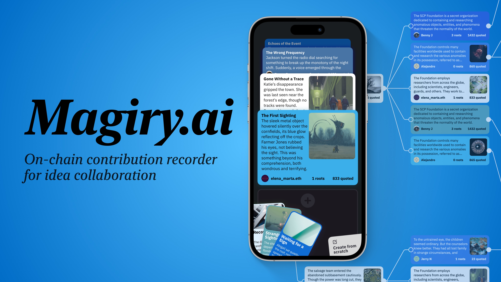


Magiry.ai is a tool for team graphic and text creative collaboration on the Ethereum. 


GPT-4-based AI model that automatically analyzes user-posted graphic and text content on the same topic, includes: 
- automatic association and referencing of existing content
- copyright confirmation
- automatic estimation of 'creative contribution' to the content.

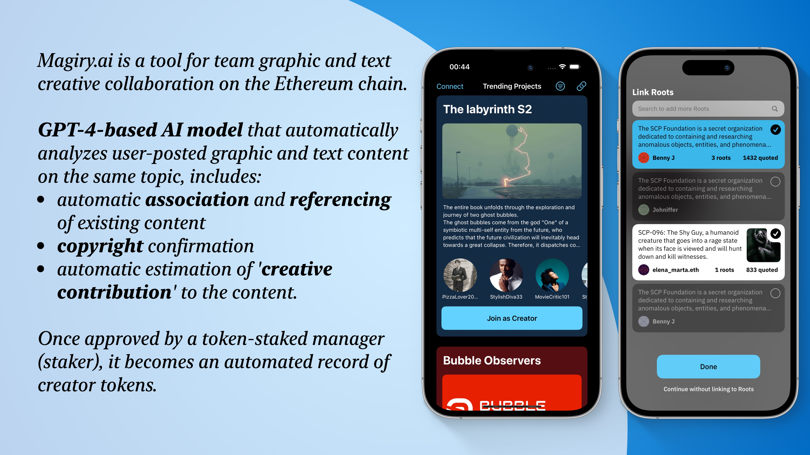

Once approved by a token-staked manager (staker), it becomes an automated record of creator tokens.

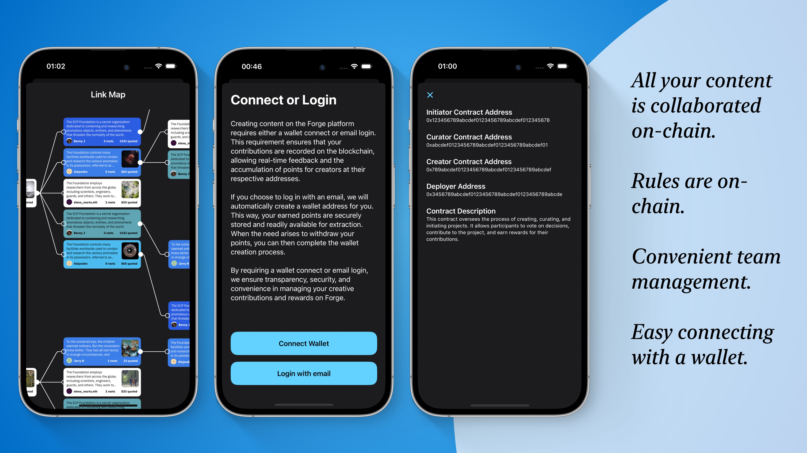

Super easy way for creator onboarding:


   
### Team
    
- **bL1nk^**: Full stack developer, 
AI algorithm, 2018 Apple WWDC Scholarship winner
- **Serein Ai**: Expert in creator economy, former Alibaba, operated 1 million+ creators, 10 million+ DAU Content App, responsible for creator live streaming e-commerce with an annual $3 billion+ GMV
    
### Goals for This Hackathon

1. Buidling Magiry.ai for easier and transparent creative collaborations on Ethereum.
2. looking forward to moving forward together with talented buidlers globally.
3. Exploring high-performance creative collaboration solutions through Ethereum Layer2 integrations.

### Progress in the First Two Days of the Hackathon

1. Design product core functions, user flow and art style
2. Initialize GPT4 API to Ethereum while minimizing the on-chain interaction.
3. Tested creative recording and tokenomics frameworks.

### Demo Link

[Pitch Video of Magiry.ai](https://youtu.be/ifuIPDwWeJ4)

### Github repo
    
[repo of Magiry.ai](https://github.com/Kincc-9999/magipop_Magiry.ai)

### Originality Statement
    
This project, developed from scratch during this hackathon, is a completely original creation.

# 4. FairSharing

项目名称：FairSharing - 一个解决公平分配的tool
所选赛道：Public Goods
项目图片：
!https://cdn.nlark.com/yuque/0/2023/png/5377219/1697419291529-67dbab2c-1536-43bd-9dee-c89cce50fd4c.png

简介：
去中心化、透明、远程的协作方式越来越流行，这种协作方式是全新的生产关系，也就需要新的Native的tool，FairSharing就是这类tool的探索，通过记录项目成员的贡献到链上，然后按照贡献公平分配，从而激励更多人创造。
典型use case：比如DAO或社区内的小团队做一个项目；比如Grant提供方希望track被资助项目的协作过程和交付结果     
技术上我们利用了ETH的L2（OP）和EAS（Ethereum Attestation Service）。

队长和队员：Mike (@xiaohou77)，Kahn (@crazyyuan)

本项目在这次黑客松的目标：Day 1完成合约，Day 2/3完成前后端

黑客松前两日的进度：完成了基本流程的demo


# 5. WeiWallet

💰**WeiWallet**（多签钱包）

## 所选赛道（Public Goods，Layer2 Application，Zero Knowledge 主赛道三选一）

Public Goods

## 项目图片（1张有代表性的图片，不要过长）


## 简介

WeiWallet借鉴了SAFE钱包并进行创新，市面上的多签钱包都是以**门限值**的形式进行创建的，这种类型的多签特点就是每位成员的“决策份量”是一样的，那么就会产生一种问题，既成员的资金占比不同，所要获得的“决策份量”权益也不同，最合理的办法就是**按照权重百分比的形式进行“决策权”的分配**。所以这也是WeiWallet解决的问题：在创建钱包的阶段用户进行权重的分配，规定每位成员所占比例，并且设置权重类型的门槛值。打个比方：user1（权重40%），user2（权重30%），user3（权重30%）权重的门槛值为：50%。那么必须至少两人进行签名，事务才可以进行。

## 产品部分功能展示

在设置功能中可以对钱包成员进行：删除、替换、新增、更改用户权重、更改权重门槛值的功能

### 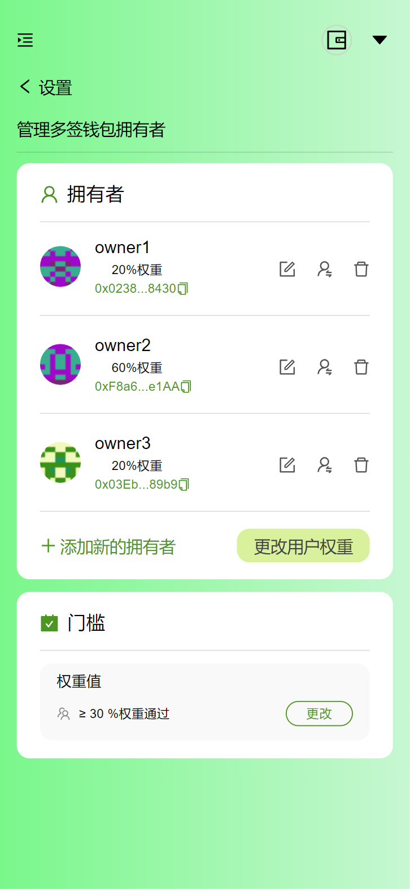

删除用户，需要对权重值进行重新分配

### 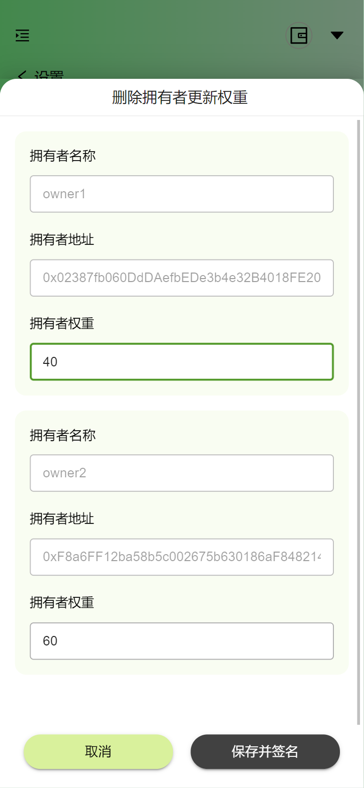

### 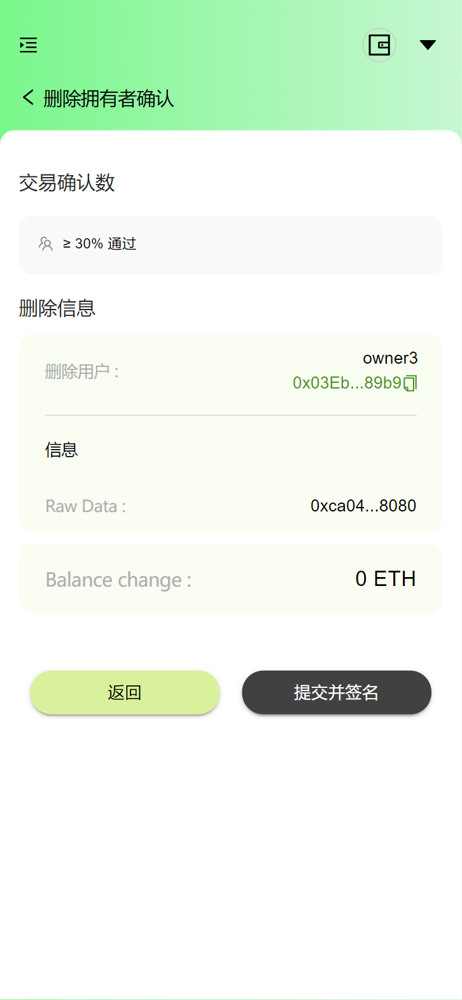

### 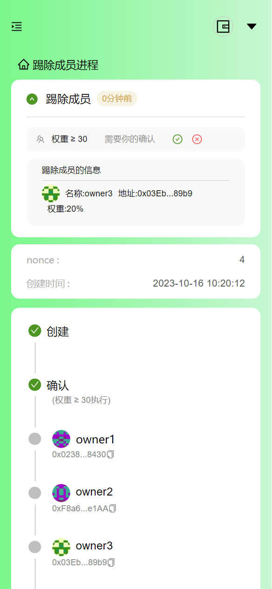


### 添加成员

### 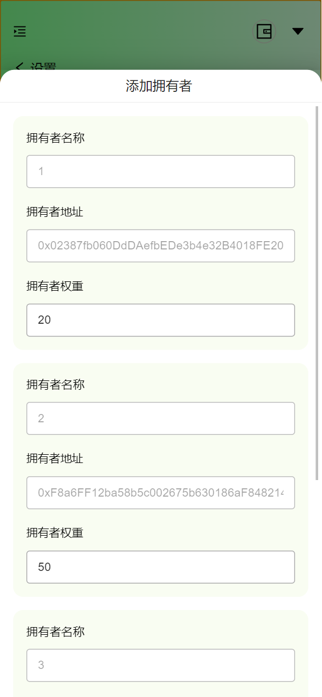

### 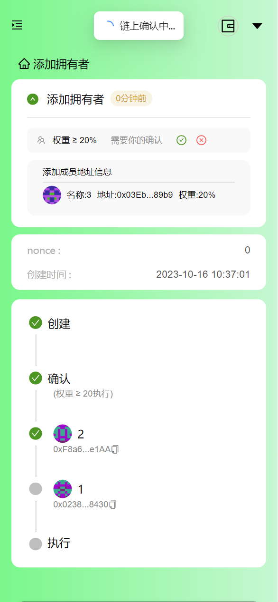


### 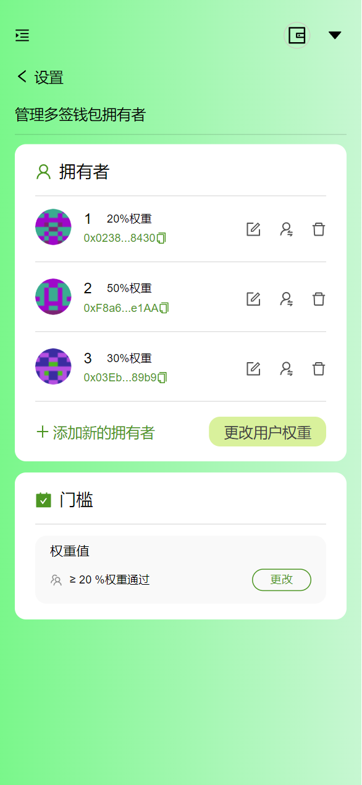

## 队长和队员

- fatdove（@fatdove77）-前端开发
-  0xE (@YiJingGuo) -合约开发
- ed (@China-Chris) -后端开发

## 本项目在这次黑客松的目标

完成权重值多签钱包的创建工作，完成多签钱包最基本的事务类型（转账、成员操作）。

## 黑客松前两日的进度

- day1：
  - 头脑风暴确定demo方案，团队成员集体讨论并确定Demo的方向和目标
  - 制作demo原型创，建一个简单的Demo原型
  - 绘制ui，设计应用的用户界面，包括页面布局、颜色、字体等。
  - 前端根据ui进行页面的绘制
  - 合约开发编写工厂合约与逻辑合约，完成钱包的clone创建、成员的初始化，基于EIP-712完成添加成员，踢出成员，替换成员，并进行测试。
  
- day2：

  - 合约部署，部署智能合约到区块链网络中

  - 准备域名
  
  - 部署后端程序，将程序部署到测试服务器上
  
  - 合约开发完成修改成员权重值，修改权重门限值，用户的钱包创建时的salt值记录、时间记录等。
  
  - 前端开发根据合约和后端接口，前端进行业务逻辑的接入，完成：权重钱包创建，转账功能，添加成员，踢出成员，替换成员，修改成员权重值功能。
  
  - 联合调试，前后端联合调试代码
  
  - 录制 demo 视频
  
    


## Demo 视频链接（可以是录屏或其他形式），可以选择的视频平台：[Youtube](https://youtube.com)，[Bilibili](https://bilibili.com)，[Loom](https://www.loom.com/)，视频长度不能超过3分钟，否则扣分。

[Weiwallet introduction video of ETH HangZhou Hackathon_哔哩哔哩_bilibili](https://www.bilibili.com/video/BV16H4y1R7ZN/?spm_id_from=333.999.0.0&vd_source=db89d007f7de87088a6b79918a5525fc)

## 项目 github repo 链接

前端：[fatdove77/MultipleSignatureWalletHZHackathon (github.com)](https://github.com/fatdove77/MultipleSignatureWalletHZHackathon)

后端：https://github.com/China-Chris/MultipleWallets

合约：[YiJingGuo/ETH-HangZhou-Hackathon-WeiWallet: ETH Hangzhou Hackathon Project｜基于权重值的多签合约钱包（合约部分） (github.com)](https://github.com/YiJingGuo/ETH-HangZhou-Hackathon-WeiWallet)

## 声明

该项目是本次hackathon期间，从0到1开发的项目，完全原创

## 项目 Demo 链接（选填）

https://neweddy.top/


# 6. State Identification

**1 项目名称**: State Identification

<a href="https://ibb.co/Lx5qFpP"></a>

**4 简介**: 

状态存证是基于状态通道技术，针对Massive Adoption开发的Web3公共物品，便于项目方进行链上合约的部署与交互，并通过链上合约保障用户资产安全，避免项目方作恶，降低项目方服务器被攻击时的损失

**5 队长和队员**: 

队长: [@北海](https://github.com/smileonesmile) 队友：[@donald](https://github.com/shamirsecret) 
**6 本项目在这次黑客松的目标**

目标：
1. 创建状态存证合约 state identification，能够按照参数要求返回所有相关的信息。
    ```solidity
    function openChannel(uint256 amount)
    function _updateBalance(address participant, uint256 newBalance)
    function closeChannel(uint256 newBalance, uint256 close_nonce, bytes calldata adminSignature) external
    ```
2. 新建一个页面，用来演示整个状态存证和数据库交互

**7 黑客松前两日的进度**
- Day 0:编写合约

- Day 1:编写演示前后端

**8 视频链接**
[点击这里观看视频](https://www.youtube.com/watch?v=GcKP-ao5HUQ)

**9 项目 github repo 链接**
所有代码都在
[https://github.com/ShamirSecret]
**10 是否基于之前的项目**
该项目是本次hackathon期间，从0到1开发的项目，完全原创。
**24.11 项目 Demo 链接（选填）**
http://124.221.74.51:5000

# 7. MOD 6551

**1 项目名称**: MOD 6551

**2 所选赛道**: Public Goods

**3 项目图片**:

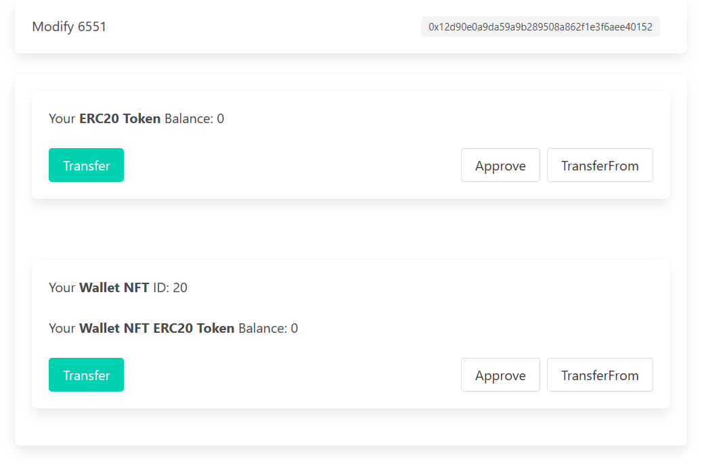

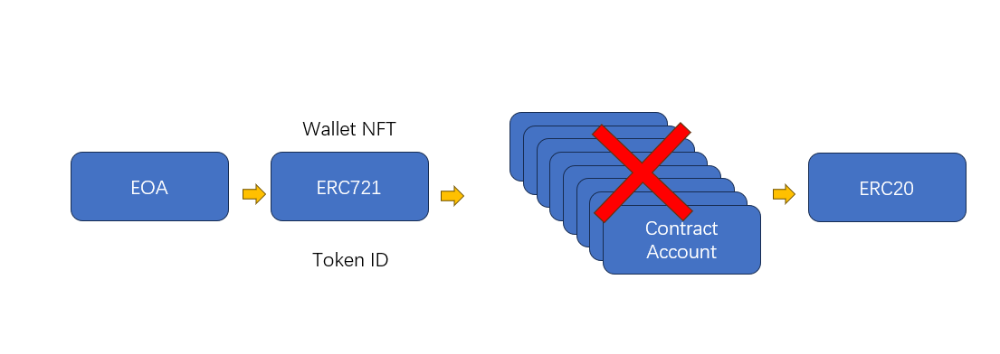

**4 简介**: 

ERC6551 是一个让人兴奋的协议，它让任何 NFT 可以作为一个钱包。从钱包的角度讲，我们终于可以有一个固定的钱包地址，并且私钥则可以经常更新，以保证资产安全。

但是，6551 和 AA 一样，需要每个用户部署一个合约，带来两个问题 1. 用户需要支付昂贵的 gas 2. 链上状态爆炸。
我们正在设计建设的以太坊兼容 L1 BitPoW 公链的重要目标，必须抑制状态爆炸！（私货：gas我们可以超级便宜，不是问题）因为节点的膨胀会导致区块链的中心化。
所以我们选择魔改 ERC6551 来实现我们的目标，在新的 L1 和大量 L2 上，我们完全有条件部署升级版本的 ERC20，避免每个用户部署一个新的智能合约。

**5 队长和队员**: 

队长: [KJ](https://github.com/kernel1983)

**6 本项目在这次黑客松的目标:**

目标：
1. 修改 ERC20 数据结构，能够使 balances 和 allowed 能够支持 tokenid：
    ```solidity
    mapping (address => mapping (uint256 => uint256)) public balances;
    mapping (address => mapping (uint256 => mapping (address => mapping (uint256 => uint256)))) public allowed;
    ```
    同时重载方法，支持 tokenid：
    ```solidity
    function balanceOf(address _owner) external view returns (uint256 balance);
    function balanceOf(address _owner, uint256 _from_tokenid) external view returns (uint256 balance);
    function transfer(address _to, uint256 _value) external returns (bool success);
    function transfer(address _to, uint256 _value, uint256 _from_tokenid, uint256 _to_tokenid) external returns (bool success);
    function transferFrom(address _from, address _to, uint256 _value) external returns (bool success);
    function transferFrom(address _from, address _to, uint256 _value, uint256 _from_tokenid, uint256 _to_tokenid) external returns (bool success);
    ```
2. 本地快速合约测试脚本，用于测试驱动开发。
    https://github.com/kernel1983/mod6551/blob/main/scripts/mod6551.py
    ```bash
    brownie run mod6551 --network hardhat
    ```
   
**7 黑客松前两日的进度**
- Day 0:
  - [x] 确定项目和目标 GitHub repo 的新建：https://github.com/kernel1983/
  - [x] 细化任务：
    1. 修改 ERC20 数据结构。
    2. 修改 ERC20 transfer 方法，以及快速测试脚本。
    3. 修改 ERC721，增加erc20_transfer方法。
    4. 修改 ERC20 approve 方法和 transferFrom 方法。
    5. Option，创建一个UI。
  - [x] 查看 foundry 文档，以及源码，确定修改路径。
- Day 1:
  - [x] 完成任务 1-3。
  修改数据结构比较顺利，在修改 transfer 方法的时候，使用 brownie 调试代码比较烧脑，为了增加效率引入了快速测试脚本。
- Day 2:
  - [x] 完成任务 4。
  - [ ] 开始任务 5 快速学习 CSS 框架。
  因为 solidity 代码我们之后也要用 python 再做一遍，但是构建的 UI 前端未来可以复用，所哟我们佛系的开发了 UI。
- Day 3:
  - [x] 完成 team info。
  - [ ] 持续完善任务 5。
**8 视频链接:**
https://youtu.be/NMWOreI3nEw
**9 项目 github repo 链接:**
https://github.com/kernel1983/mod6551
**10 是否基于之前的项目:**
该项目是本次hackathon期间，从0到1开发的项目，完全原创。
本项目服务以太坊生态，同时也用于我们的新公链 L1 BitPoW。
**24.11 项目 Demo 链接（选填）:**

# 8. GasTokens
**1 项目名称**: GasToken

**2 所选赛道**: Layer2 Application

**3 项目图片**:


**4 简介**: 

在社交金融（SocialFi）或游戏金融（GameFi）项目中，能够从交易中扣除税费并将税费分配给所有代币持有者是一个非常吸引人的特点。想象一下，当一个玩家在游戏中进行交易时，其他所有玩家都可以从中获得收益，这不仅可以增加玩家的收入，还可以大大提高玩家的参与积极性和活跃度。这种机制鼓励了更多的玩家参与和互动，从而为整个生态系统创造了更大的价值。然而如何有效、公平且低成本地分配交易税费成为了一个核心问题, GasToken应运而生，旨在为此问题提供一个创新的解决方案。  
Transactionless: GasToken的最大亮点之一是它的"transactionless"特性。与传统方法不同，用户无需主动调用任何函数或进行任何交易。一旦有交易发生，税费将自动、即时地分配给所有代币持有者。这大大简化了用户的操作，同时也降低了gas的消耗。  
Frictionless收益：用户获得的收益是无摩擦的，意味着他们可以随时、无任何限制地访问和使用这些收益，无需担心额外的费用或延迟。

**5 队长和队员**: 

队长: [Joe](https://github.com/1anyway)&nbsp;&nbsp;&nbsp;<a href="mailto:zhouzhe194@gmail.com">zhouzhe194@gmail.com</a>

**6 本项目在这次黑客松的目标:**

目标：
1. 使用solidity智能合约实现reflection核心算法  
2. 以ERC20 token(GasToken)为例实现该算法的应用

**7 黑客松前两日的进度**  

Day0:  

查找相关资料，阅读算法paper，调研市面上成功的reflection token的应用


Day1:  
根据算法开始进行工程上的初步实现，使用solidity编写核心算法，使用Foundry搭建测试框架。


**8 视频链接:**  

https://www.youtube.com/watch?v=rfGEdIT6pFw

**9 项目 github repo 链接:**   

所有代码都在  

https://github.com/1anyway/GasTokens  

**10 是否基于之前的项目:**  

该项目是本次hackathon期间，从0到1开发的项目，完全原创。

**11 项目 Demo 链接（选填）:**  

https://www.youtube.com/watch?v=rfGEdIT6pFw

# 9. X-Wallet
1. 项目名称

  **X-Wallet**

2. 所选赛道

  *L2 Application*

3. 项目图片（1 张有代表性的图片，不要过长）

  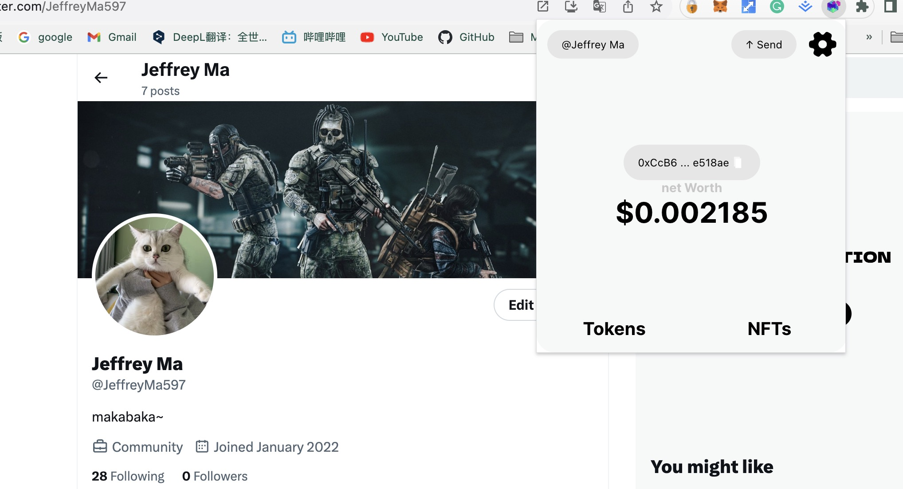

  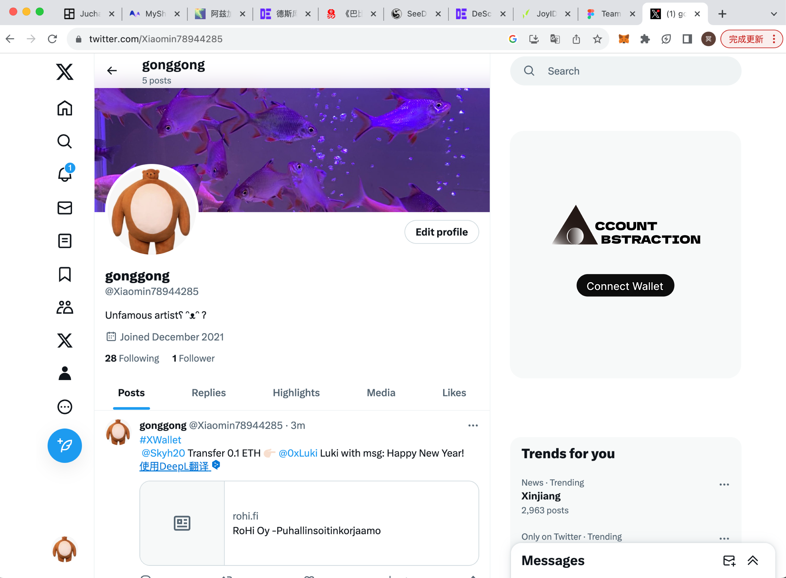

  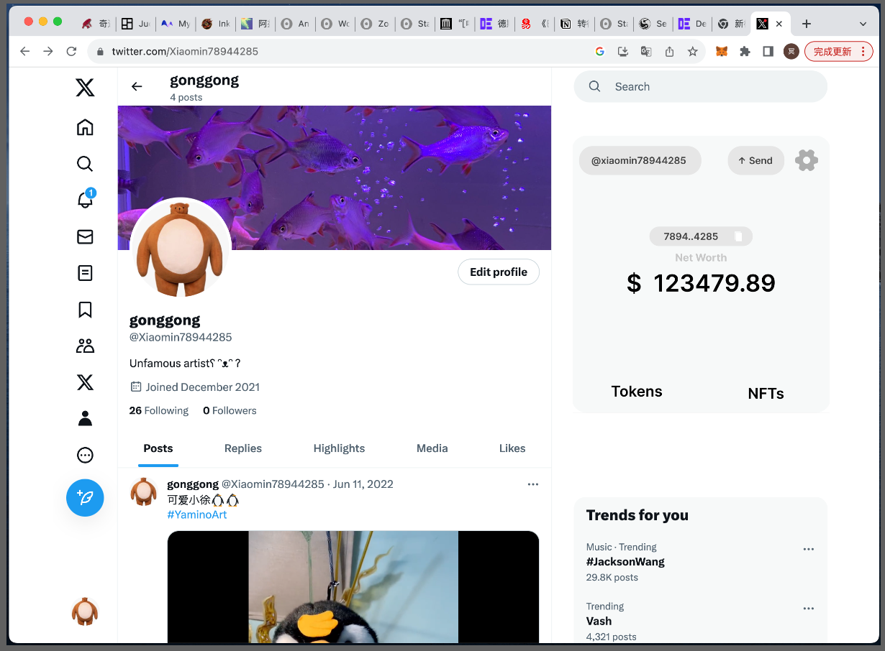

4. 简介

  Twitter Onboarding AA Wallet

5. 队长和队员

  队长：Luki

  队员：Skyh，Jun，Neal

6. 本项目在这次黑客松的目标

twitter 插件，接入 AA，预计算 AA 钱包地址，AA 钱包转账

7. 黑客松前两日的进度

D1:研究 Zerodev 和 Twitter 插件

D2:解决预计算地址难题和前端设计开发

D3:水会通宵开发

8. Demo 视频链接

https://www.youtube.com/watch?v=6F5nezkBNHs

9. 项目 github repo 链接

https://github.com/0xLukin/x-wallet-ethhangzhou

10. 声明未基于之前的项目，

该项目是本次 hackathon 期间，从 0 到 1 开发的项目，完全原创。

11. 项目 Demo 链接（选填）

https://github.com/0xLukin/x-wallet-ethhangzhou/blob/main/xwallet.zip