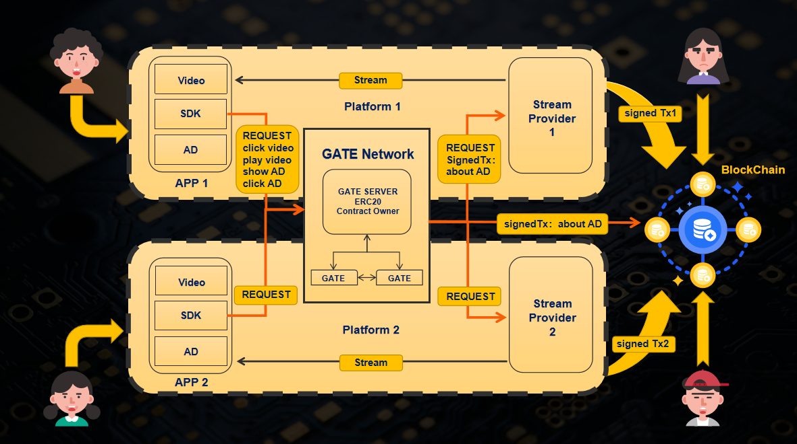

# ETH Hangzhou Hackathon 项目提交说明

ETH Hangzhou Hackathon 的项目需要提交到本页，PR（Pull-Request）截止时间为 2023年10月16日 下午14:00（北京时间，UTC+8）。你需要在你的项目下更新以下内容:
1. 项目名称
2. 所选赛道（Public Goods，Layer2 Application，Zero Knowledge 主赛道三选一）
3. 项目图片（1张有代表性的图片，不要过长）
4. 简介
5. 队长和队员
6. 本项目在这次黑客松的目标
7. 黑客松前两日的进度
8. Demo 视频链接（可以是录屏或其他形式），可以选择的视频平台：[Youtube](https://youtube.com)，[Bilibili](https://bilibili.com)，[Loom](https://www.loom.com/)，视频长度不能超过3分钟，否则扣分。
9. 项目 github repo 链接
10. 声明未基于之前的项目, 如: 该项目是本次hackathon期间，从0到1开发的项目，完全原创。
11. 项目 Demo 链接（选填）

在截止时间前提交 PR，且包含前 10 项信息的项目，视为提交成功，否则不参与评奖。

评委将在2023年10月16日下午14-18点期间，根据以下4个维度对项目进行第一轮打分，每个赛道的前5名可以参加晚上19点的Demo Day：
1. 代码 🧱
2. 创新性 💡
3. Demo完整度 📝
4. 对以太坊生态的重要性 ♻️

进入Demo Day的每个项目有 5 分钟展示时间。

❗❗❗项目提交PR示例详见：https://github.com/eth-hangzhou/ETHHangzhou/pull/6

# Decentralized-Video-revenue-Distribution

**1 项目名称**: Decentralized-Video-revenue-Distribution

**2 所选赛道**: Layer2 Application

**3 项目图片**:

**4 简介**:

该项目是一个去中心化的视频收益分配平台，主要解决目前广告方，视频创作者和视频平台之间的收益分配问题。广告商的支出和创作者的收益不再是完全由视频平台来决定。项目中的 token 不像 defi 项目具有较高的货币属性，用户浏览视频产生的流量以 token 的形式进行价值的转换。项目中的 nft 本身没有价值，只会选择托管方，创作者能够选择将视频托管到能够得到更多分成的平台，打破了生产资料被掌握在资本手中的局面。广告商的每一分钱都花在了广告曝光量上。

主要功能： 

1. 当创作者上传视频到平台同时会收到一份 NFT 来作为凭证 
2. 用户通过 App 观看视频产生流量的同时，会触发 App 的 sdk 来检测用户行为并向 Gate 发起请求，此时 Gate 会构建一笔 mint 交易 将 token 以 一定的比例发给创造者和视频平台， 并对这笔交易签名之后发送给视频平台，平台会检查这笔交易是否正确，验证通过之后 会将 视频流 推给用户 ，之后视频平台可以随时将该笔交易发送到链上来获取 token 
3. 创作者和平台拥有 token 之后，可以将 token 卖给广告商，广告商有了 token 之后就可以在 App 中发布广告，当用户浏览到广告之后，也会向 gate 发起请求，此时 Gate 就会 burn 掉广告商一定量的 token

**5 队长和队员**:

队长: 贺飞[@NavaFee](https://github.com/NavaFee) 队友：徐莉程[@lilywest2022](https://github.com/lilywest2022) 黄世龙[@sloongh](https://github.com/sloongh) 谭焕琪[@xiaoqiqiii](https://github.com/xiaoqiqiii)

**6 本项目在这次黑客松的目标:**

目标：

1. 构建一个不再是一些DeFi类型的零和游戏项目，可以实现三方共赢的全新idea！
2. 完成一个mvp，实现项目的基本功能，制作一个完整的Demo。

**7 黑客松前两日的进度**

- Day 0:
  - [x] 完成组队，GitHub repo 的新建：https://github.com/NavaFee/Decentralized-Video-revenue-Distribution
  - [x] 细化任务：
    1. 确定合约实现是技术细节。
    2. 确定前端所需的功能。
    3. 完成项目计划书。
    4. 前后端联调，完善mvp
  - [x] 完成并测试合约功能。
- Day 1:
  - [x] 完成任务 1-4.
  - [x] 完善代码细节
  - [x] 完成 team info 以及视频录制等。

**8 视频链接:**

- [YouTube](https://youtu.be/pqs76fcAOUs) length: 2m45s

**9 项目 github repo 链接:**

所有代码都在

- [Github repo](https://github.com/NavaFee/Decentralized-Video-revenue-Distribution)

**10 是否基于之前的项目:**

该项目是本次 hackathon 期间，从 0 到 1 开发的项目，完全原创。

